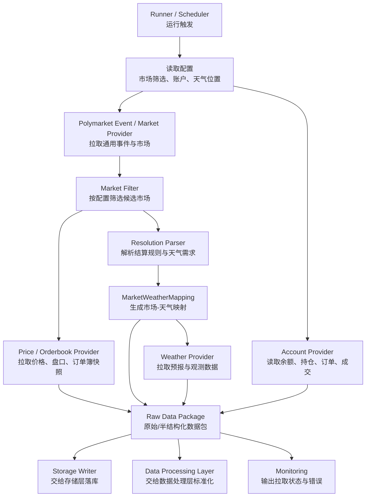
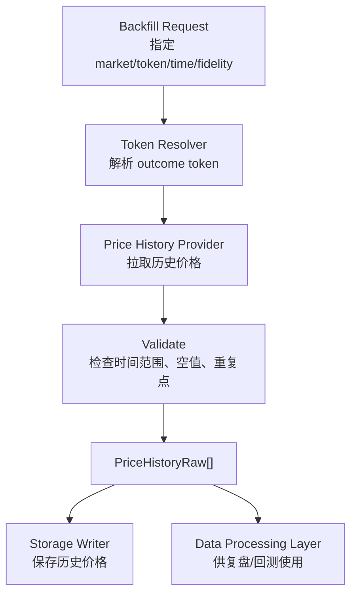
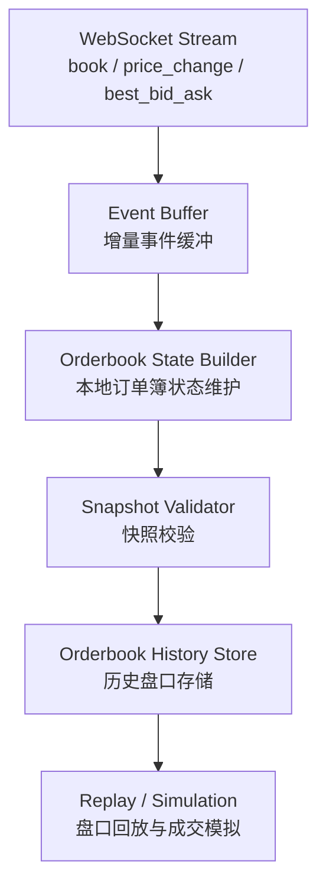

# 数据接入层 PRD

## 1. 文档定位

本文档是 Polymarket 天气 Alpha 量化项目的数据接入层主 PRD，用于明确数据接入层的产品目标、模块边界、MVP 范围、外部数据源、核心数据对象、流程、验收标准与待决策事项。

数据接入层的职责是：**统一获取外部数据，并以稳定、可追溯、可扩展的方式交给数据处理层、策略层、存储层、执行层使用。**

本文档仅进行产品设计，不涉及开发实现。

---

## 2. 背景与目标

项目目标是构建一个面向 Polymarket 天气市场的个人量化系统，核心路径是：

```text
获取市场数据、天气数据、账户数据
        ↓
标准化处理
        ↓
策略判断
        ↓
生成交易信号
        ↓
小资金实盘执行
        ↓
记录、复盘、迭代
```

数据接入层是整个链路的上游基础。它不负责策略判断、不负责数据清洗建模、不负责数据库表结构设计细节、不负责下单执行，但必须保证下游拿到的数据是完整、及时、可追溯的。

### 2.1 产品目标

MVP 阶段目标：

1. 支持通用 Polymarket `event / market` 数据接入，不只面向天气市场硬编码。
2. 支持拉取实时与准实时市场价格、盘口、流动性数据。
3. 支持拉取真实账户数据，包括余额、持仓、订单、成交。
4. 支持历史价格轻量回补，用于复盘与后续回测。
5. 支持天气数据接入的统一抽象，具体主天气源待最终确认。
6. 为未来 WebSocket（网页套接字）增量订单簿重建预留接口。
7. 为存储层提供可落库、可追溯、可扩展的数据记录。

### 2.2 非目标

MVP 阶段暂不做：

1. 不做全市场历史订单簿长期归档。
2. 不做 WebSocket 增量订单簿事件长期落库。
3. 不做复杂多天气源融合。
4. 不做完整历史回测系统。
5. 不在数据接入层做策略判断。
6. 不在数据接入层做复杂数据标准化，标准化归属数据处理层。
7. 不在数据接入层直接设计数据库迁移方案，数据库细节归属存储层。

---

## 3. 模块边界

### 3.1 数据接入层负责

| 能力 | 说明 |
|---|---|
| Polymarket event / market 拉取 | 获取通用事件与市场信息，支持筛选 |
| Polymarket 价格与盘口拉取 | 获取 price、midpoint、spread、orderbook 当前快照 |
| Polymarket 历史价格回补 | 按 token、时间范围、采样粒度拉取价格历史 |
| 账户数据读取 | 获取余额、持仓、订单、成交 |
| 天气数据拉取 | 通过统一 WeatherProvider 接口获取预报与观测数据 |
| 数据源元信息记录 | 记录 source、endpoint、run_time、request 参数等追溯信息 |
| 错误与状态暴露 | 向监控层输出数据拉取成功、失败、延迟、限流等状态 |

### 3.2 数据接入层不负责

| 不负责能力 | 归属模块 | 原因 |
|---|---|---|
| 字段标准化与时间对齐 | 数据处理层 | 接入层只保证原始与半结构化数据可获得 |
| 概率估计 | 策略层 | 接入层不做交易判断 |
| 风控过滤 | 风控层 | 避免数据层耦合交易逻辑 |
| 下单、撤单 | 执行层 | 接入层只读账户与交易结果 |
| 数据库表结构与 DAO 细节 | 存储层 | 接入层只定义数据交付要求 |
| 通知推送 | 通知与监控层 | 接入层只暴露状态与错误 |

---

## 4. MVP 范围

### 4.1 必做能力

#### 4.1.1 Polymarket 通用市场数据

必须支持通用 `event / market`，并允许在拉取阶段做筛选。下游模块也应以通用 `event / market` 为基础，不把天气市场写死为唯一类型。

MVP 必须支持：

1. 拉取 event 列表。
2. 拉取 market 列表。
3. 根据条件筛选市场。
4. 拉取 market 详情。
5. 识别 market 状态，例如 active、closed、resolved。
6. 保留原始响应引用或原始响应摘要，方便排查字段变更。

筛选条件建议包括：

| 筛选项 | 说明 |
|---|---|
| tag / category | 例如 weather、politics、sports 等 |
| keyword | 按 question、title、description 搜索 |
| active / closed | 是否仍可交易 |
| resolved | 是否已结算 |
| end_time | 按结束时间筛选 |
| volume | 按成交量筛选 |
| liquidity | 按流动性筛选 |
| market_id / event_id | 指定市场或事件 |

#### 4.1.2 实时与准实时价格数据

必须支持：

1. 获取 outcome token 的当前价格。
2. 获取 best bid / best ask。
3. 获取 midpoint（中间价）。
4. 获取 spread（价差）。
5. 获取 orderbook（订单簿）当前快照。
6. 支持按单个 market 或批量 market 拉取。
7. 暴露数据时间戳与拉取时间，避免下游误用陈旧数据。

#### 4.1.3 订单簿当前快照

MVP 只要求当前快照，不要求历史订单簿归档。

当前快照至少需要包含：

| 字段 | 说明 |
|---|---|
| market_id | Polymarket market ID |
| token_id / asset_id | outcome token ID |
| outcome | YES / NO 或对应 outcome 名称 |
| bids | 买盘档位列表 |
| asks | 卖盘档位列表 |
| best_bid | 最优买价 |
| best_ask | 最优卖价 |
| spread | 价差 |
| midpoint | 中间价 |
| depth | 档位深度摘要 |
| timestamp | 数据源时间戳 |
| fetched_at | 本地拉取时间 |

#### 4.1.4 历史价格轻量回补

历史价格进入 MVP 的必须实现范围。

MVP 要求：

1. 支持按 token 拉取历史价格。
2. 支持指定 `start_time` 与 `end_time`。
3. 支持指定 `fidelity`（采样粒度）。
4. 支持指定相对时间窗口，例如 1h、6h、1d、1w、1m、max。
5. 输出统一价格点序列。
6. 避免默认全市场全量回补。

历史价格最小字段：

| 字段 | 说明 |
|---|---|
| token_id / asset_id | outcome token ID |
| market_id | 所属 market |
| timestamp | 价格点时间 |
| price | 价格 |
| source | 数据来源 |
| fidelity | 采样粒度 |
| fetched_at | 拉取时间 |

历史价格用于：

1. 策略信号复盘。
2. 市场走势观察。
3. 后续回测层的数据基础。
4. 后续分析市场价格对天气预报更新的反应。

#### 4.1.5 订单簿历史预留

MVP 不做订单簿历史归档，但必须在产品设计中预留接口。

未来方向：

```text
WebSocket 增量事件
        ↓
本地订单簿状态维护
        ↓
快照校验
        ↓
订单簿历史重建
        ↓
盘口回放 / 成交模拟 / 流动性分析
```

MVP 阶段只要求：

1. 接口命名和数据对象不要阻碍未来历史订单簿扩展。
2. 当前订单簿快照对象中保留 `snapshot_id`、`hash` 或可校验字段。
3. 明确标注历史订单簿能力为 V1/V2 范围。

#### 4.1.6 账户与持仓数据

MVP 需要真实账户读取。

必须支持：

| 数据 | 说明 |
|---|---|
| balance | 账户余额 |
| positions | 当前持仓 |
| open orders | 当前未成交订单 |
| historical orders | 历史订单 |
| trades / fills | 成交记录 |

待确认是否需要纳入 MVP：

| 数据 | 待确认点 |
|---|---|
| deposit / withdraw | 是否读取充值提现记录 |
| cancelled orders | 是否单独保留已撤订单视图 |
| account snapshot | 是否每轮运行保存账户权益快照 |

账户数据要求：

1. 所有账户读取必须是只读接口。
2. API key、私钥、钱包信息不得写入 PRD 正文或代码仓库。
3. 账户数据必须带 `fetched_at`，用于与策略信号、订单执行对齐。
4. 失败时必须输出明确错误类型，例如认证失败、权限不足、限流、网络失败。

#### 4.1.7 天气数据接入抽象

天气数据是项目核心输入。MVP 阶段优先支持以下天气来源：

1. Open-Meteo。
2. NOAA GFS。
3. CMA / 中国气象数据网。

天气源设计必须同时满足两端约束：

```text
Polymarket market resolution rules（结算规则）需要什么
        ↑
        匹配与映射
        ↓
天气数据源实际能提供什么
```

因此，数据接入层不能只接“预报最准”的 API，而要同时管理：

1. `resolution_source`（结算来源）：市场最终按哪个官方来源、网站、站点、指标、时间窗口结算。
2. `forecast_source`（预测来源）：策略用于提前判断概率的预报模型或 API。
3. `observation_source`（观测来源）：用于临近结算、结果核验、偏差校准的实况或历史观测来源。

在产品边界上：

1. 必须存在统一 WeatherProvider（天气数据提供者）抽象。
2. 策略层不得直接调用具体天气 API。
3. 数据接入层需要支持 forecast（预报）与 observation（观测）两类数据。
4. 每条天气数据必须记录 source、model、run_time、forecast_time、location、variable、unit。
5. 每个 Polymarket 天气 market 必须维护 resolution source（结算来源）映射，不能默认所有天气市场使用同一个结算源。
6. 如果 market 的结算规则无法解析出明确来源，该 market 在策略层应被标记为 `resolution_source_unknown`，不得进入自动实盘交易。

##### 4.1.7.1 Polymarket 结算需求

Polymarket 官方文档说明，每个 market 都有预定义 resolution rules（结算规则），其中会指定 resolution source（结算来源）、end date（可结算时间）与 edge cases（边界情况）。对天气市场而言，接入层需要从 market 的 question、description、rules 或相关 metadata 中提取并保存以下信息。

| 字段 | 说明 |
|---|---|
| market_id | Polymarket market ID |
| event_id | 所属 event ID |
| question | 市场题干 |
| resolution_rules_raw | 原始结算规则文本或引用 |
| resolution_source_name | 结算来源名称，例如 NWS、NOAA、某官方气象站、某网站 |
| resolution_source_url | 结算来源 URL，若规则提供 |
| resolution_location_text | 规则中的地点文本 |
| resolution_station_id | 站点 ID，若规则提供 |
| resolution_metric | 结算指标，例如最高温、最低温、累计降水、降雪、风速 |
| resolution_time_window | 结算时间窗口，例如某自然日、本地时间某小时段 |
| resolution_timezone | 结算使用时区 |
| resolution_unit | 结算单位，例如 °F、°C、inch、mm、mph、km/h |
| edge_case_rules | 平局、四舍五入、缺测、官方修正等规则 |
| parsed_confidence | 解析置信度 |
| needs_manual_review | 是否需要人工确认 |

产品原则：

1. 市场题干只描述交易问题，真正结算依据以 rules 为准。
2. 同一城市、同一指标也可能因 market 不同而使用不同结算来源。
3. 若结算来源是具体网站或官方页面，必须保存 URL 或可追溯引用。
4. 若结算来源是具体站点，必须保存站点 ID、经纬度、站点名称。
5. 若结算单位与预测源单位不同，接入层保留原始单位，单位换算由数据处理层完成。

##### 4.1.7.2 天气源供给能力

MVP 优先天气源按用途分工，而不是三者互相替代。

| 数据源 | MVP 角色 | 核心供给 | 主要限制 | 产品定位 |
|---|---|---|---|---|
| Open-Meteo | MVP 默认 forecast provider（预测数据提供者） | JSON API、经纬度查询、小时级/日级预报、历史预报、历史天气、可选 GFS/CMA 等模型 | 非最终官方结算源；非商业使用通常无需账号/API key，商业或高调用量需关注条款 | MVP 默认接入入口，优先跑通策略闭环 |
| NOAA GFS | 全球主预测源 | 全球数值预报、温度、降水、风、气压等变量，通常 00/06/12/18 UTC 每日四次运行 | 官方 NOMADS/HTTPS/AWS Open Data 通常无需账号/API key；原始数据多为 GRIB2，接入和解析成本高 | MVP 可通过 Open-Meteo GFS 使用；直接官方 GFS 接入作为 V1 增强 |
| CMA / 中国气象数据网 | 中国区域官方补充源 | 中国区域实况、站点/格点数据、预报、预警、部分开放接口 | 通常需要注册、申请、审核或授权；接口权限、稳定性、调用限制需逐项确认；对非中国市场价值有限 | 中国区域市场优先核验源与补充预测源 |

Open-Meteo 在 MVP 中需要支持的最小能力：

| 能力 | 说明 |
|---|---|
| Forecast API | 按经纬度拉取未来预报 |
| Historical Forecast API | 拉取历史预报，用于复盘当时能看到什么预测 |
| Historical Weather API | 拉取历史天气或再分析数据，用于粗粒度结果核验 |
| GFS API | 通过 JSON 快速使用 NOAA GFS 预报 |
| CMA API | 通过 JSON 快速使用 CMA GRAPES 预报，作为中国区域补充 |
| hourly variables | temperature_2m、precipitation、rain、snowfall、wind_speed_10m、wind_gusts_10m 等 |
| daily variables | temperature_2m_max、temperature_2m_min、precipitation_sum、snowfall_sum、wind_speed_10m_max 等 |

凭证要求：

1. Open-Meteo：MVP 非商业个人使用按无需账号/API key 设计；如果后续调用量升高或用途变化，再评估 commercial access（商业访问）或 self-hosted（自托管）。
2. NOAA GFS：MVP 通过 Open-Meteo 间接使用时无需 NOAA 凭证；V1 直接访问 NOAA NOMADS / HTTPS / AWS Open Data 时，按公开数据无账号/API key 设计，但需要处理 GRIB2 与下载限速。
3. CMA / 中国气象数据网：按需要账号、申请、审核、授权或 API key 设计，MVP 在未确认授权前只作为预留或通过 Open-Meteo CMA 间接使用。

NOAA GFS 在 MVP / V1 中的分层：

| 阶段 | 设计 |
|---|---|
| MVP | 通过 Open-Meteo GFS API 获取 GFS 相关预报，降低接入成本 |
| V1 | 直接接入 NOAA 官方 GFS 数据，保留 run_time、forecast_hour、grid、variable |
| V2 | 支持更多 NOAA 模型或 ensemble（集合预报），用于概率分布估计 |

CMA / 中国气象数据网在 MVP / V1 中的分层：

| 阶段 | 设计 |
|---|---|
| MVP | 通过 Open-Meteo CMA API 或已获授权的中国气象数据接口获取中国区域预报/实况 |
| V1 | 接入中国气象数据网或中国天气网 SmartWeatherAPI（智慧天气 API）等官方/授权接口 |
| V2 | 建立中国区域站点级观测与格点预报映射，用于偏差校准 |

##### 4.1.7.3 供需匹配矩阵

不同天气 market 对数据的需求不同，数据接入层需要按市场需求选择数据源组合。

| Polymarket 结算需求 | 优先预测源 | 优先核验源 | 接入层处理 |
|---|---|---|---|
| 美国城市最高温/最低温 | Open-Meteo GFS / NOAA GFS | 规则指定来源，若为 NOAA/NWS 则优先官方 | 拉 hourly/daily 温度，保存本地日界线与单位 |
| 全球城市温度 | Open-Meteo GFS | 规则指定来源；无明确来源则人工确认 | 按经纬度拉 GFS，保留 grid 与 timezone |
| 中国城市温度/降水 | Open-Meteo CMA / CMA 官方接口 | CMA / 中国气象数据网授权数据 | 维护城市到站点/经纬度映射 |
| 降雨/降雪累计 | Open-Meteo GFS/CMA、NOAA GFS | 规则指定观测源 | 必须保存累计窗口、单位和本地日界线 |
| 风速/阵风 | Open-Meteo GFS/CMA、NOAA GFS | 规则指定观测源 | 保存高度口径，例如 10m wind |
| 结算源为具体网页 | 不一定等于预测源 | 具体网页或其引用数据 | 保存 URL、抓取时间、页面证据引用 |
| 结算源不明确 | 不进入自动交易 | 人工确认 | 标记 `needs_manual_review=true` |

##### 4.1.7.4 天气数据源选择策略

MVP 推荐策略：

```text
先解析 market 结算规则
        ↓
判断是否需要人工确认
        ↓
按地区和指标选择预测源
        ↓
保存 forecast / observation / resolution mapping
        ↓
交给数据处理层做单位、时区、时间窗口标准化
```

默认选择逻辑：

1. 如果 market 明确指定 NOAA / NWS / 美国官方来源：预测源使用 Open-Meteo GFS，结算核验源优先 NOAA/NWS 官方或规则指定页面。
2. 如果 market 是中国区域：预测源优先 Open-Meteo CMA 或 CMA 授权接口；核验源优先 CMA / 中国气象数据网。
3. 如果 market 是非中国全球城市且无特定官方来源：预测源优先 Open-Meteo GFS；结算来源必须人工确认后才能自动交易。
4. 如果 market 指定第三方网站作为结算源：该网站是 resolution source，Open-Meteo/NOAA/CMA 只能作为 forecast source。
5. 如果同一 market 可由多个源预测：全部保留 source/model/run_time，策略层后续可比较模型分歧。

天气数据最小字段：

| 字段 | 说明 |
|---|---|
| source | 数据源，例如 Open-Meteo、NOAA GFS、CMA / 中国气象数据网 |
| provider_type | forecast / observation / resolution_evidence |
| model | 预报模型，例如 GFS、CMA GRAPES |
| run_time | 模型运行时间 |
| forecast_time | 预报对应时间 |
| observed_time | 观测对应时间，预报数据可为空 |
| location_id | 内部位置 ID |
| station_id | 站点 ID，若适用 |
| lat / lon | 经纬度 |
| timezone | 时区 |
| variable | 天气变量，例如 max_temperature、precipitation |
| value | 数值 |
| unit | 单位 |
| fetched_at | 拉取时间 |
| raw_data_ref | 原始数据引用，可选 |

##### 4.1.7.5 MarketWeatherMapping

为了连接 Polymarket 结算需求与天气数据供给，数据接入层需要输出 `MarketWeatherMapping`（市场-天气映射）对象。

| 字段 | 说明 |
|---|---|
| market_id | Polymarket market ID |
| event_id | 所属 event ID |
| location_id | 内部位置 ID |
| location_name | 标准地点名 |
| lat / lon | 经纬度 |
| station_id | 站点 ID，若适用 |
| resolution_source_name | 结算来源名称 |
| resolution_source_url | 结算来源 URL |
| forecast_provider | 预测 Provider |
| forecast_model | 预测模型 |
| observation_provider | 观测 Provider |
| target_variable | 目标天气变量 |
| target_date | 目标日期 |
| target_time_window | 目标时间窗口 |
| timezone | 结算时区 |
| unit | 结算单位 |
| parsing_status | parsed / manual_review / failed |
| parsing_reason | 解析说明 |
| created_at | 创建时间 |
| updated_at | 更新时间 |

验收要求：

1. 每个进入策略判断的天气 market 必须有一条有效 `MarketWeatherMapping`。
2. `parsing_status != parsed` 的 market 不允许自动实盘。
3. 映射对象必须保留规则原文引用，方便人工复核。
4. forecast provider 与 resolution source 可以不同，不能强行等同。

---

## 5. 数据对象设计

本节定义产品层面的数据对象，不等同于最终数据库表结构。

### 5.1 EventRaw

| 字段 | 说明 |
|---|---|
| event_id | Polymarket event ID |
| title | 事件标题 |
| slug | 事件 slug |
| description | 事件描述 |
| category / tags | 分类与标签 |
| start_time | 开始时间 |
| end_time | 结束时间 |
| status | 状态 |
| markets | 关联 market 列表或引用 |
| source | 数据源 |
| fetched_at | 拉取时间 |

### 5.2 MarketRaw

| 字段 | 说明 |
|---|---|
| market_id | Polymarket market ID |
| event_id | 所属 event ID |
| question | 市场问题 |
| description / rules | 市场描述与结算规则 |
| outcomes | outcome 列表 |
| token_ids | outcome token ID 列表 |
| active | 是否可交易 |
| closed | 是否关闭 |
| resolved | 是否已结算 |
| end_time | 结束时间 |
| volume | 成交量 |
| liquidity | 流动性 |
| raw_payload_ref | 原始响应引用 |
| fetched_at | 拉取时间 |

### 5.3 PriceSnapshotRaw

| 字段 | 说明 |
|---|---|
| market_id | market ID |
| token_id / asset_id | outcome token ID |
| outcome | outcome 名称 |
| price | 当前价格 |
| best_bid | 最优买价 |
| best_ask | 最优卖价 |
| midpoint | 中间价 |
| spread | 价差 |
| timestamp | 数据源时间 |
| fetched_at | 拉取时间 |

### 5.4 OrderBookSnapshotRaw

| 字段 | 说明 |
|---|---|
| snapshot_id | 本地快照 ID |
| market_id | market ID |
| token_id / asset_id | outcome token ID |
| bids | 买盘档位 |
| asks | 卖盘档位 |
| min_order_size | 最小订单数量 |
| tick_size | 最小价格单位 |
| hash | 订单簿校验哈希，如数据源提供 |
| timestamp | 数据源时间 |
| fetched_at | 拉取时间 |

### 5.5 PriceHistoryRaw

| 字段 | 说明 |
|---|---|
| token_id / asset_id | outcome token ID |
| market_id | market ID |
| timestamp | 历史价格点时间 |
| price | 历史价格 |
| fidelity | 采样粒度 |
| source | 数据源 |
| fetched_at | 拉取时间 |

### 5.6 AccountSnapshotRaw

| 字段 | 说明 |
|---|---|
| account_id / wallet_address | 账户或钱包标识 |
| cash_balance | 可用余额 |
| total_value | 总权益，若可获得 |
| token_balances | token 余额摘要 |
| fetched_at | 拉取时间 |

### 5.7 PositionRaw

| 字段 | 说明 |
|---|---|
| market_id | market ID |
| token_id / asset_id | outcome token ID |
| outcome | YES / NO 或 outcome 名称 |
| size | 持仓数量 |
| avg_price | 平均成本，若可获得 |
| current_price | 当前价格，若可获得 |
| realized_pnl | 已实现盈亏，若可获得 |
| unrealized_pnl | 未实现盈亏，若可获得 |
| fetched_at | 拉取时间 |

### 5.8 OrderRaw

| 字段 | 说明 |
|---|---|
| order_id | 订单 ID |
| market_id | market ID |
| token_id / asset_id | outcome token ID |
| side | BUY / SELL |
| price | 委托价格 |
| size | 委托数量 |
| filled_size | 已成交数量 |
| status | 订单状态 |
| created_at | 订单创建时间 |
| updated_at | 订单更新时间 |
| fetched_at | 拉取时间 |

### 5.9 TradeRaw

| 字段 | 说明 |
|---|---|
| trade_id | 成交 ID |
| order_id | 关联订单 ID |
| market_id | market ID |
| token_id / asset_id | outcome token ID |
| side | BUY / SELL |
| price | 成交价格 |
| size | 成交数量 |
| fee | 手续费，若可获得 |
| traded_at | 成交时间 |
| fetched_at | 拉取时间 |

### 5.10 WeatherRaw

| 字段 | 说明 |
|---|---|
| source | 天气数据源 |
| provider_type | forecast / observation / resolution_evidence |
| model | 天气模型 |
| run_time | 模型运行时间 |
| forecast_time | 预报时间 |
| observed_time | 观测时间 |
| location_id | 位置 ID |
| station_id | 站点 ID，若适用 |
| lat / lon | 经纬度 |
| timezone | 时区 |
| variable | 天气变量 |
| value | 数值 |
| unit | 单位 |
| raw_data_ref | 原始数据引用 |
| fetched_at | 拉取时间 |

### 5.11 MarketWeatherMapping

| 字段 | 说明 |
|---|---|
| market_id | Polymarket market ID |
| event_id | 所属 event ID |
| location_id | 内部位置 ID |
| location_name | 标准地点名 |
| lat / lon | 经纬度 |
| station_id | 站点 ID，若适用 |
| resolution_source_name | 结算来源名称 |
| resolution_source_url | 结算来源 URL |
| forecast_provider | 预测 Provider |
| forecast_model | 预测模型 |
| observation_provider | 观测 Provider |
| target_variable | 目标天气变量 |
| target_date | 目标日期 |
| target_time_window | 目标时间窗口 |
| timezone | 结算时区 |
| unit | 结算单位 |
| parsing_status | parsed / manual_review / failed |
| parsing_reason | 解析说明 |
| created_at | 创建时间 |
| updated_at | 更新时间 |

---

## 6. 核心流程

### 6.1 一次运行的数据接入流程



### 6.2 历史价格回补流程



### 6.3 未来订单簿历史重建流程



---

## 7. 配置需求

MVP 阶段需要一个统一配置入口，数据接入层至少需要以下配置。

### 7.1 Polymarket 配置

| 配置项 | 说明 |
|---|---|
| api_base_url | API 基础地址 |
| clob_base_url | CLOB API 基础地址 |
| data_base_url | Data API 基础地址 |
| request_timeout | 请求超时时间 |
| retry_times | 重试次数 |
| rate_limit | 本地限流配置 |
| market_filters | 市场筛选条件 |
| price_refresh_interval | 价格刷新间隔 |
| orderbook_depth_limit | 本地保留订单簿档位数，若需要 |

### 7.2 账户配置

| 配置项 | 说明 |
|---|---|
| wallet_address | 钱包地址 |
| api_key_ref | API key 引用，不保存明文 |
| private_key_ref | 私钥引用，不保存明文 |
| account_refresh_interval | 账户刷新间隔 |
| include_orders | 是否读取订单 |
| include_trades | 是否读取成交 |

### 7.3 天气配置

| 配置项 | 说明 |
|---|---|
| weather_providers | 启用的天气 Provider，MVP 优先 Open-Meteo、NOAA GFS、CMA / 中国气象数据网 |
| default_forecast_provider | 默认预测 Provider，MVP 确认为 Open-Meteo |
| fallback_provider | 备用天气 Provider，可选 |
| locations | 城市、站点、经纬度配置 |
| variables | 天气变量 |
| forecast_horizon | 预报时间范围 |
| observation_window | 观测时间范围 |
| timezone_policy | 时区策略 |
| resolution_source_policy | 结算来源解析与人工确认策略 |

### 7.4 历史价格配置

| 配置项 | 说明 |
|---|---|
| enabled | 是否启用历史价格回补 |
| default_fidelity | 默认采样粒度 |
| max_backfill_days | 单次最大回补天数 |
| batch_size | 批量 token 数 |
| allow_max_range | 是否允许拉取 max 全量 |

---

## 8. 数据质量与错误处理

### 8.1 数据新鲜度

每类数据必须带 `fetched_at`。如果数据源提供自身时间戳，也必须保留源时间戳。

建议新鲜度要求：

| 数据 | MVP 新鲜度要求 |
|---|---|
| event / market | 分钟级或按运行轮次刷新 |
| price / midpoint / spread | 秒级到分钟级 |
| orderbook 当前快照 | 秒级到分钟级 |
| account / position | 每轮策略运行前刷新 |
| historical price | 按需回补，不要求实时 |
| weather forecast | 按模型更新时间刷新 |
| weather observation | 按观测源更新时间刷新 |

### 8.2 错误类型

必须区分以下错误：

| 错误 | 说明 |
|---|---|
| AuthenticationError | 认证失败 |
| PermissionError | 权限不足 |
| RateLimitError | 被限流 |
| NetworkError | 网络失败 |
| TimeoutError | 请求超时 |
| SchemaChangedError | 响应结构变化 |
| EmptyDataError | 返回为空 |
| DataStaleError | 数据过期 |
| PartialDataError | 批量拉取部分失败 |

### 8.3 降级策略

MVP 降级原则：

1. 市场列表拉取失败：本轮策略不运行，并输出错误。
2. 单个 market 详情失败：跳过该 market，记录原因。
3. 价格或订单簿失败：该 market 不进入策略判断。
4. 账户读取失败：实盘交易不得继续；只允许进入观察或 dry_run（模拟运行）模式。
5. 天气数据失败：该 market 不进入策略判断。
6. 历史价格回补失败：不影响实时策略运行，但必须记录失败任务。

---

## 9. 对下游模块的交付

### 9.1 给数据处理层

交付：

1. EventRaw。
2. MarketRaw。
3. PriceSnapshotRaw。
4. OrderBookSnapshotRaw。
5. PriceHistoryRaw。
6. WeatherRaw。
7. MarketWeatherMapping。
8. AccountSnapshotRaw。
9. PositionRaw。
10. OrderRaw。
11. TradeRaw。

数据处理层负责：

1. 字段标准化。
2. 时间标准化。
3. outcome 标准化。
4. 天气变量标准化。
5. market 与 weather 的映射。
6. 输出策略层 ContextBuilder 构造 StrategyContext（策略上下文）所需的标准化对象。

### 9.2 给存储层

交付要求：

1. 所有数据对象必须可序列化。
2. 批量写入友好。
3. 保留 source、fetched_at、raw_data_ref。
4. 不依赖 SQLite 特性，未来可迁移 PostgreSQL。
5. 大字段原始响应可使用引用方式，不强制全部塞入主表。

### 9.3 给策略层

数据接入层不直接服务策略层。策略层只能消费数据处理层产出的标准化对象。

约束：

```text
Strategy 不直接调用 Polymarket API
Strategy 不直接调用 Weather API
Strategy 不直接读取账户 API
```

### 9.4 给执行层

执行层可以复用账户与订单读取能力，但下单、撤单能力归执行层。

数据接入层只提供：

1. 账户余额读取。
2. 持仓读取。
3. 订单状态读取。
4. 成交记录读取。

---

## 10. MVP 验收标准

数据接入层 PRD 完成后，后续开发的验收标准应包括：

1. 能拉取通用 Polymarket event / market 数据。
2. 能通过配置筛选候选 market。
3. 能拉取 market 详情与 outcome token。
4. 能拉取实时或准实时 price。
5. 能拉取 midpoint 与 spread。
6. 能拉取当前 orderbook 快照。
7. 能按 token、时间范围、fidelity 拉取历史价格。
8. 能读取真实账户余额。
9. 能读取当前持仓。
10. 能读取未成交订单。
11. 能读取历史订单。
12. 能读取成交记录。
13. 能通过统一 WeatherProvider 拉取天气数据。
14. 能为天气 market 生成 `MarketWeatherMapping`，明确 resolution source、forecast source 与 observation source。
15. `resolution_source` 无法明确的 market 不进入自动实盘。
16. 所有数据都带 `source` 与 `fetched_at`。
17. 账户读取失败时不会继续真实交易流程。
18. 单个 market 数据失败不会导致全局任务崩溃，除非是核心市场列表失败。
19. 历史订单簿接口有预留，但 MVP 不要求实现历史重建。
20. 数据接入层不包含策略判断逻辑。

---

## 11. 阶段规划

### 11.1 MVP

1. Polymarket 通用 event / market 拉取。
2. 市场筛选。
3. 当前价格、midpoint、spread、orderbook 快照。
4. 历史价格轻量回补。
5. 真实账户余额、持仓、订单、成交读取。
6. 天气 Provider 抽象与 Open-Meteo、NOAA GFS、CMA / 中国气象数据网优先接入路径。
7. MarketWeatherMapping 市场-天气映射。
8. 数据拉取状态与错误输出。

### 11.2 V1

1. 更完善的 market-resolution source 映射。
2. 更稳定的天气源接入与备用源。
3. 账户快照序列化与资金曲线支持。
4. 更完整的历史价格回补任务管理。
5. WebSocket 实时行情监听，但不一定长期归档。

### 11.3 V2

1. WebSocket 增量订单簿重建。
2. 历史盘口回放。
3. 多天气源融合。
4. 官方 NOAA GFS / ECMWF 等复杂数据源深度接入。
5. 更完整的数据质量评分。

---

## 12. 待确认事项

以下事项在本轮尚未最终确认，不应在开发时自行臆断：

1. NOAA GFS 官方 GRIB2 是否仅作为 V1，MVP 只通过 Open-Meteo GFS 间接使用。
2. CMA / 中国气象数据网是否已有可用账号、授权接口或 API 文档。
3. 账户模块是否需要读取 deposit / withdraw（充值提现）记录。
4. 账户模块是否需要每轮保存 account snapshot（账户快照）作为 MVP 必做。
5. cancelled orders（已撤订单）是否需要作为独立数据视图展示或落库。
6. 历史价格默认 fidelity（采样粒度）与单次最大回补范围。
7. 当前订单簿快照是否需要保存 top N 档，还是只保存完整原始快照引用与 best bid/ask 摘要。
8. market 筛选条件的初始配置：是否以 weather tag 为主，还是按关键词和白名单市场启动。
9. resolution source 无法自动解析时，人工确认流程由谁维护、以什么文件或表格作为真值来源。

---

## 13. 外部参考

设计参考了项目级 PRD、已有策略层建议文档、已有天气 API 选型说明，以及 Polymarket 官方 API 文档。

关键外部接口方向：

1. Polymarket Gamma API：event / market 数据。
2. Polymarket CLOB API：orderbook、price、midpoint、spread、price history。
3. Polymarket Data API：positions、trades、activity 等账户与用户相关数据。
4. Open-Meteo API：MVP 快速接入天气 forecast / historical forecast / historical weather。
5. NOAA GFS：全球主预测模型，MVP 可通过 Open-Meteo GFS 间接使用，V1 预留官方 GRIB2 接入。
6. CMA / 中国气象数据网：中国区域官方天气数据补充与核验来源。

---

## 14. 一句话原则

```text
数据接入层只负责把外部世界稳定、及时、可追溯地带进系统；不做判断，但必须让后续判断有据可查。
```
