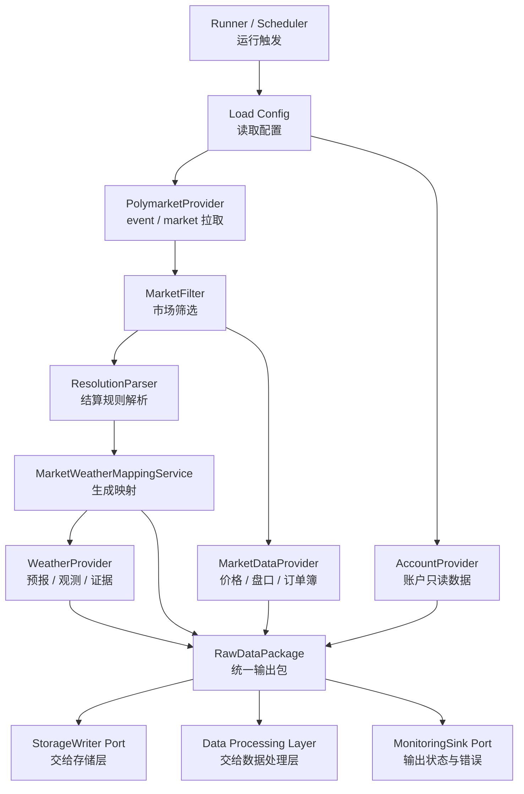

# 数据接入层开发设计文档

## 1. 文档定位

本文档是 `prd/模块设计/01 数据接入层/数据接入层.md` 的开发设计文档，用于把产品 PRD 转换为可实施、可评审、可验收的工程设计。

数据接入层的核心职责是：

```text
从外部数据源获取数据
        ↓
保留原始语义、来源、时间与请求上下文
        ↓
输出 Raw（原始/半结构化）对象与状态
        ↓
交给 Storage（存储层）与 Data Processing（数据处理层）
```

本层不做 Strategy（策略）判断，不做复杂字段标准化，不做下单，不直接决定市场是否交易。它只负责把外部世界稳定、及时、可追溯地带进系统。

## 2. 设计目标

### 2.1 MVP 目标

1. 支持通用 Polymarket `event / market` 数据拉取与筛选。
2. 支持 Polymarket price（价格）、midpoint（中间价）、spread（价差）、orderbook snapshot（订单簿快照）拉取。
3. 支持按 token 与时间范围进行 price history（历史价格）轻量回补。
4. 支持只读账户数据：balance（余额）、positions（持仓）、open orders（未成交订单）、historical orders（历史订单）、trades / fills（成交记录）。
5. 支持统一 WeatherProvider（天气数据提供者）抽象，MVP 以 Open-Meteo 为默认 forecast provider（预测数据提供者）。
6. 支持 MarketWeatherMapping（市场-天气映射），明确 resolution source（结算来源）、forecast source（预测来源）与 observation source（观测来源）。
7. 向下游输出可序列化、可批量落库、可追溯的数据对象。
8. 明确错误类型、降级策略与数据新鲜度状态。

### 2.2 非目标

MVP 阶段不实现以下能力：

1. 不做 WebSocket（网页套接字）增量订单簿历史重建。
2. 不做全市场历史订单簿长期归档。
3. 不做多天气源融合与概率估计。
4. 不做完整回测系统。
5. 不在接入层实现数据库迁移方案。
6. 不在接入层实现下单、撤单或交易风控。
7. 不在接入层把天气市场写死为唯一市场类型。

## 3. 架构总览

### 3.1 模块组成

```text
data_ingestion/
  config/
    schemas.py
  core/
    errors.py
    models.py
    package.py
    time.py
  providers/
    polymarket/
      gamma_client.py
      clob_client.py
      data_client.py
      account_client.py
      provider.py
    weather/
      base.py
      open_meteo.py
      noaa_gfs.py
      cma.py
    resolution/
      parser.py
      mapping.py
  services/
    market_filter.py
    ingestion_runner.py
    price_backfill_service.py
    freshness.py
  ports/
    storage_writer.py
    monitoring_sink.py
```

说明：

| 目录 | 职责 |
|---|---|
| `config` | 定义数据接入层配置结构，不保存密钥明文 |
| `core` | 通用错误、数据对象、RawDataPackage（原始数据包） |
| `providers/polymarket` | Polymarket Gamma / CLOB / Data / Account API 接入 |
| `providers/weather` | WeatherProvider 抽象与具体天气源实现 |
| `providers/resolution` | 结算规则解析与 MarketWeatherMapping 生成 |
| `services` | 一次运行编排、市场筛选、历史价格回补、数据新鲜度检查 |
| `ports` | 对存储层、监控层的接口契约 |

### 3.2 架构模式

数据接入层采用 Provider（数据提供者）+ Adapter（适配器）模式：

| 层次 | 职责 |
|---|---|
| Client | 只处理外部 HTTP 请求、认证、重试、限流、响应状态码 |
| Provider | 把外部响应转换为内部 Raw DTO（原始数据传输对象） |
| Service | 编排多个 Provider，处理筛选、回补、映射、新鲜度与降级 |
| Port | 对存储层、监控层暴露稳定接口 |

设计约束：

1. Provider 不调用策略层、执行层、通知层。
2. Adapter 不把外部 API 裸字典直接传给下游。
3. 新增 NOAA GFS、ECMWF、CMA 官方源时，应新增 Provider 实现与配置，不修改主流程核心编排。

### 3.3 一次运行链路



### 3.4 RunContext

每次接入运行必须创建统一 RunContext（运行上下文），贯穿日志、RawDataPackage 与错误记录。

| 字段 | 说明 |
|---|---|
| `ingestion_run_id` | 本轮接入运行 ID |
| `started_at` | 运行开始时间 |
| `config_version` | 配置版本或配置摘要 |
| `provider_versions` | Provider 名称与版本 |
| `request_scope` | 本轮请求范围，例如筛选条件、market_ids、token_ids |
| `dry_run` | 是否模拟运行 |
| `live_trading_allowed` | 本轮是否允许进入实盘链路 |

`live_trading_allowed=false` 时，接入层仍可采集数据并输出原因，但不得让下游进入真实交易路径。

## 4. 关键设计原则

1. Data Source（数据源）与 Strategy（策略）解耦：策略层不得直接调用 Polymarket API、Weather API 或 Account API。
2. Raw First（原始优先）：接入层优先保留原始字段、原始响应引用、请求参数和拉取时间。
3. Traceability（可追溯性）：所有对象必须包含 `source`、`fetched_at`，有源时间戳时必须保留 `timestamp`、`run_time` 或 `forecast_time`。
4. Failure Isolation（失败隔离）：单个 market 失败不拖垮全局，核心 market 列表失败才阻断本轮运行。
5. Read Only Account（账户只读）：账户模块只读取余额、持仓、订单、成交，不做下单与撤单。
6. Extensible Providers（可扩展数据提供者）：Open-Meteo、NOAA GFS、CMA 等通过统一接口接入。
7. MVP First（优先 MVP）：保留扩展接口，但不提前实现 V1/V2 的重型能力。
8. Idempotency（幂等性）：重试和重复运行不得造成不可控重复数据。

## 5. 外部接口分层

### 5.1 Polymarket Gamma API

用途：

1. 拉取 event 列表。
2. 拉取 market 列表。
3. 拉取 market 详情。
4. 获取 question、description、rules、outcomes、token_ids、状态、成交量与流动性等信息。

建议组件：

| 组件 | 责任 |
|---|---|
| `GammaClient` | HTTP Client（HTTP 客户端），只封装请求、重试、错误转换 |
| `PolymarketMarketProvider` | 输出 `EventRaw`、`MarketRaw` |
| `MarketFilter` | 根据配置筛选候选 market |

### 5.2 Polymarket CLOB API

用途：

1. 拉取 outcome token 当前价格。
2. 拉取 best bid / best ask。
3. 拉取 midpoint 与 spread。
4. 拉取 orderbook snapshot（订单簿快照）。
5. 拉取 price history（历史价格）。

建议组件：

| 组件 | 责任 |
|---|---|
| `ClobClient` | CLOB 请求封装 |
| `PriceProvider` | 输出 `PriceSnapshotRaw` |
| `OrderBookProvider` | 输出 `OrderBookSnapshotRaw` |
| `PriceHistoryProvider` | 输出 `PriceHistoryRaw[]` |
| `PriceBackfillService` | 管理按需回补任务，不做全市场默认回补 |

### 5.3 Polymarket Data / Account API

用途：

1. 读取 balance（余额）。
2. 读取 positions（持仓）。
3. 读取 open orders（未成交订单）。
4. 读取 historical orders（历史订单）。
5. 读取 trades / fills（成交记录）。

约束：

1. 所有接口必须只读。
2. 钱包地址、API key、私钥只能通过配置引用或环境变量引用读取，不能写入文档正文、代码仓库或日志。
3. 账户读取失败时，本轮真实交易流程必须停止，只允许进入 dry_run（模拟运行）或 observation（观察）模式。

### 5.4 Weather API

WeatherProvider（天气数据提供者）统一接口：

```python
from typing import Protocol

class WeatherProvider(Protocol):
    name: str

    def get_forecast(self, request: "WeatherRequest") -> list["WeatherRaw"]:
        ...

    def get_observation(self, request: "WeatherRequest") -> list["WeatherRaw"]:
        ...

    def get_metadata(self) -> "ProviderMetadata":
        ...
```

MVP 实现顺序：

1. `OpenMeteoProvider`：MVP 默认实现，用 JSON API 快速跑通 forecast / historical forecast / historical weather。
2. `NoaaGfsProvider`：MVP 只保留接口或通过 Open-Meteo GFS 间接使用；直接 NOAA GRIB2 作为 V1。
3. `CmaProvider`：MVP 保留接口；如没有账号或授权，不能假设可直接调用官方接口。

注意：PRD 中同时出现“具体主天气源待最终确认”和“默认预测 Provider 确认为 Open-Meteo”的表述。本文档按 MVP 工程默认选择 Open-Meteo 设计，但在正式开发前仍应由用户最终确认是否把 Open-Meteo 作为首个必实现 provider。

## 6. 核心数据对象

本节是开发对象设计，不等同于最终数据库表结构。建议使用 dataclass 或 Pydantic（数据校验库）模型；如果后续项目采用 Pydantic，应限制在 DTO（数据传输对象）边界，避免策略层依赖外部响应结构。

### 6.1 通用字段约定

所有 Raw 对象建议包含：

| 字段 | 说明 |
|---|---|
| `source` | 数据源，例如 `polymarket_gamma`、`polymarket_clob`、`open_meteo` |
| `fetched_at` | 本地拉取时间，UTC |
| `raw_data_ref` | 原始响应引用，可为文件路径、对象存储 key 或摘要 |
| `request_id` | 本轮请求 ID，便于串联日志 |
| `ingestion_run_id` | 本轮接入任务 ID |

### 6.2 幂等键建议

存储层最终幂等策略由存储层决定，接入层需要提供足够字段支持去重。

| 数据对象 | 建议幂等键 |
|---|---|
| `EventRaw` | `source + event_id + fetched_at` 或 `source + event_id + source_updated_at` |
| `MarketRaw` | `source + market_id + fetched_at` 或 `source + market_id + source_updated_at` |
| `PriceSnapshotRaw` | `source + market_id + token_id + timestamp` |
| `OrderBookSnapshotRaw` | `source + market_id + token_id + snapshot_id`，无 `snapshot_id` 时用 `timestamp + hash` |
| `PriceHistoryRaw` | `source + market_id + token_id + timestamp + fidelity` |
| `WeatherRaw` | `source + provider_type + model + run_time + forecast_time + observed_time + location_id + variable` |
| `MarketWeatherMapping` | `market_id + resolution_rules_raw_ref + updated_at` |
| `OrderRaw` | `source + order_id + updated_at` |
| `TradeRaw` | `source + trade_id` |

### 6.3 EventRaw

| 字段 | 类型建议 | 说明 |
|---|---|---|
| `event_id` | `str` | Polymarket event ID |
| `title` | `str | None` | 事件标题 |
| `slug` | `str | None` | 事件 slug |
| `description` | `str | None` | 事件描述 |
| `category` | `str | None` | 分类 |
| `tags` | `list[str]` | 标签 |
| `start_time` | `datetime | None` | 开始时间 |
| `end_time` | `datetime | None` | 结束时间 |
| `status` | `str | None` | 状态 |
| `market_ids` | `list[str]` | 关联 market |
| `source` | `str` | 数据源 |
| `fetched_at` | `datetime` | 拉取时间 |

### 6.4 MarketRaw

| 字段 | 类型建议 | 说明 |
|---|---|---|
| `market_id` | `str` | Polymarket market ID |
| `event_id` | `str | None` | 所属 event ID |
| `question` | `str` | 市场题干 |
| `description` | `str | None` | 市场描述 |
| `rules` | `str | None` | 结算规则 |
| `outcomes` | `list[str]` | outcome 列表 |
| `token_ids` | `list[str]` | outcome token ID 列表 |
| `active` | `bool | None` | 是否可交易 |
| `closed` | `bool | None` | 是否关闭 |
| `resolved` | `bool | None` | 是否已结算 |
| `end_time` | `datetime | None` | 结束时间 |
| `volume` | `float | None` | 成交量 |
| `liquidity` | `float | None` | 流动性 |
| `raw_payload_ref` | `str | None` | 原始响应引用 |
| `fetched_at` | `datetime` | 拉取时间 |

### 6.5 PriceSnapshotRaw

| 字段 | 类型建议 | 说明 |
|---|---|---|
| `market_id` | `str` | market ID |
| `token_id` | `str` | outcome token ID |
| `outcome` | `str | None` | outcome 名称 |
| `price` | `float | None` | 当前价格 |
| `best_bid` | `float | None` | 最优买价 |
| `best_ask` | `float | None` | 最优卖价 |
| `midpoint` | `float | None` | 中间价 |
| `spread` | `float | None` | 价差 |
| `timestamp` | `datetime | None` | 数据源时间 |
| `fetched_at` | `datetime` | 拉取时间 |

### 6.6 OrderBookSnapshotRaw

| 字段 | 类型建议 | 说明 |
|---|---|---|
| `snapshot_id` | `str` | 本地快照 ID |
| `market_id` | `str` | market ID |
| `token_id` | `str` | outcome token ID |
| `bids` | `list[OrderBookLevel]` | 买盘档位 |
| `asks` | `list[OrderBookLevel]` | 卖盘档位 |
| `best_bid` | `float | None` | 最优买价 |
| `best_ask` | `float | None` | 最优卖价 |
| `spread` | `float | None` | 价差 |
| `midpoint` | `float | None` | 中间价 |
| `min_order_size` | `float | None` | 最小订单数量 |
| `tick_size` | `float | None` | 最小价格单位 |
| `hash` | `str | None` | 校验哈希，如数据源提供 |
| `timestamp` | `datetime | None` | 数据源时间 |
| `fetched_at` | `datetime` | 拉取时间 |

`OrderBookLevel` 建议字段：

| 字段 | 类型建议 | 说明 |
|---|---|---|
| `price` | `float` | 价格 |
| `size` | `float` | 数量 |

### 6.7 PriceHistoryRaw

| 字段 | 类型建议 | 说明 |
|---|---|---|
| `token_id` | `str` | outcome token ID |
| `market_id` | `str | None` | market ID |
| `timestamp` | `datetime` | 历史价格点时间 |
| `price` | `float` | 历史价格 |
| `fidelity` | `str` | 采样粒度 |
| `source` | `str` | 数据源 |
| `fetched_at` | `datetime` | 拉取时间 |

### 6.8 AccountSnapshotRaw / PositionRaw / OrderRaw / TradeRaw

账户相关对象必须保留 `fetched_at`，并通过 `account_id` 或 `wallet_address` 与本地账户配置关联。

MVP 必做：

| 对象 | 必要字段 |
|---|---|
| `AccountSnapshotRaw` | `account_id / wallet_address`、`cash_balance`、`total_value`、`token_balances`、`fetched_at` |
| `PositionRaw` | `market_id`、`token_id`、`outcome`、`size`、`avg_price`、`current_price`、`fetched_at` |
| `OrderRaw` | `order_id`、`market_id`、`token_id`、`side`、`price`、`size`、`filled_size`、`status`、`created_at`、`updated_at`、`fetched_at` |
| `TradeRaw` | `trade_id`、`order_id`、`market_id`、`token_id`、`side`、`price`、`size`、`fee`、`traded_at`、`fetched_at` |

MVP 待确认，不作为本文档默认实现：

1. `deposit / withdraw`（充值提现）记录。
2. `cancelled orders`（已撤订单）独立视图。
3. 每轮强制保存完整 account snapshot（账户快照）。

### 6.9 WeatherRaw

| 字段 | 类型建议 | 说明 |
|---|---|---|
| `source` | `str` | 数据源，例如 `open_meteo` |
| `provider_type` | `str` | `forecast` / `observation` / `resolution_evidence` |
| `model` | `str | None` | 天气模型，例如 `GFS`、`CMA GRAPES` |
| `run_time` | `datetime | None` | 模型运行时间 |
| `forecast_time` | `datetime | None` | 预报对应时间 |
| `observed_time` | `datetime | None` | 观测对应时间 |
| `location_id` | `str` | 内部位置 ID |
| `station_id` | `str | None` | 站点 ID |
| `lat` | `float` | 纬度 |
| `lon` | `float` | 经度 |
| `timezone` | `str` | 时区 |
| `variable` | `str` | 天气变量 |
| `value` | `float | None` | 数值 |
| `unit` | `str` | 单位 |
| `raw_data_ref` | `str | None` | 原始响应引用 |
| `fetched_at` | `datetime` | 拉取时间 |

### 6.10 MarketWeatherMapping

| 字段 | 类型建议 | 说明 |
|---|---|---|
| `market_id` | `str` | Polymarket market ID |
| `event_id` | `str | None` | 所属 event ID |
| `location_id` | `str | None` | 内部位置 ID |
| `location_name` | `str | None` | 标准地点名 |
| `lat` | `float | None` | 纬度 |
| `lon` | `float | None` | 经度 |
| `station_id` | `str | None` | 站点 ID |
| `resolution_rules_raw_ref` | `str | None` | 规则原文引用 |
| `resolution_source_name` | `str | None` | 结算来源名称 |
| `resolution_source_url` | `str | None` | 结算来源 URL |
| `forecast_provider` | `str | None` | 预测 Provider |
| `forecast_model` | `str | None` | 预测模型 |
| `observation_provider` | `str | None` | 观测 Provider |
| `target_variable` | `str | None` | 目标天气变量 |
| `target_date` | `date | None` | 目标日期 |
| `target_time_window` | `str | None` | 目标时间窗口 |
| `timezone` | `str | None` | 结算时区 |
| `unit` | `str | None` | 结算单位 |
| `parsing_status` | `str` | `parsed` / `manual_review` / `failed` |
| `parsing_reason` | `str | None` | 解析说明 |
| `created_at` | `datetime` | 创建时间 |
| `updated_at` | `datetime` | 更新时间 |

硬性约束：

1. `parsing_status != "parsed"` 的 market 不允许进入自动实盘。
2. forecast provider 与 resolution source 可以不同，不能强行等同。
3. 无法从 rules 明确结算来源时，必须标记 `manual_review` 或 `failed`。

## 7. 配置设计

MVP 建议使用一个 YAML 或 TOML 配置文件。Python 环境与依赖由 `uv` 管理，运行命令优先使用 `uv run`。

### 7.1 配置结构

```yaml
data_ingestion:
  polymarket:
    api_base_url: "https://gamma-api.polymarket.com"
    clob_base_url: "https://clob.polymarket.com"
    data_base_url: "https://data-api.polymarket.com"
    request_timeout_seconds: 10
    retry_times: 3
    rate_limit_per_second: 2
    price_refresh_interval_seconds: 60
    orderbook_depth_limit: 20

    market_filters:
      tags: ["weather"]
      keywords: []
      active: true
      closed: false
      resolved: false
      min_volume: null
      min_liquidity: null
      market_ids: []
      event_ids: []

  account:
    wallet_address: "${POLYMARKET_WALLET_ADDRESS}"
    api_key_ref: "POLYMARKET_API_KEY"
    private_key_ref: "POLYMARKET_PRIVATE_KEY"
    account_refresh_interval_seconds: 60
    include_orders: true
    include_trades: true
    include_deposit_withdraw: false

  weather:
    enabled_providers: ["open_meteo"]
    default_forecast_provider: "open_meteo"
    fallback_provider: null
    forecast_horizon_days: 7
    observation_window_days: 3
    timezone_policy: "resolution_timezone_first"
    resolution_source_policy: "manual_review_if_unclear"
    variables:
      - "temperature_2m"
      - "precipitation"
      - "wind_speed_10m"

  price_history:
    enabled: true
    default_fidelity: "1h"
    max_backfill_days: 30
    batch_size: 20
    allow_max_range: false
```

### 7.2 密钥与敏感信息

1. 配置文件只保存环境变量名或 secret reference（密钥引用）。
2. 日志中不得输出 API key、私钥、签名 payload 或完整认证 header。
3. 错误对象可以包含 `credential_ref`，不能包含 credential value（凭证值）。

## 8. 核心服务设计

### 8.1 IngestionRunner

职责：

1. 创建 `ingestion_run_id`。
2. 读取并校验配置。
3. 调用 Polymarket market provider 拉取候选市场。
4. 调用 `MarketFilter` 筛选市场。
5. 对天气 market 生成 `MarketWeatherMapping`。
6. 拉取价格、盘口、订单簿快照。
7. 按映射拉取天气 forecast / observation。
8. 拉取账户只读数据。
9. 组装 `RawDataPackage`。
10. 输出给 `StorageWriter`、`MonitoringSink` 与数据处理层。

### 8.2 MarketFilter

输入：

1. `list[EventRaw]`
2. `list[MarketRaw]`
3. `MarketFilterConfig`

输出：

1. `list[MarketRaw]`
2. `FilterDecision[]`，记录每个 market 被保留或过滤的原因。

筛选支持：

| 条件 | MVP 是否支持 |
|---|---|
| tag / category | 是 |
| keyword | 是 |
| active / closed / resolved | 是 |
| end_time | 是 |
| volume | 是 |
| liquidity | 是 |
| market_id / event_id 白名单 | 是 |

### 8.3 ResolutionParser

职责：

1. 从 `question`、`description`、`rules` 与 metadata 中提取天气结算需求。
2. 输出 `MarketWeatherMapping`。
3. 对无法确定的信息标记 `manual_review`。

解析字段：

| 字段 | MVP 处理 |
|---|---|
| 结算来源名称 | 尝试解析；不明确则 manual_review |
| 结算来源 URL | 有则保存；无则为空 |
| 地点文本 | 尝试解析 |
| station_id | 有则保存；无则为空 |
| 指标 | 最高温、最低温、降水、降雪、风速等 |
| 时间窗口 | 保存原始文本，标准化交给数据处理层 |
| 时区 | 优先规则指定；不明确则 manual_review 或用配置标注 |
| 单位 | 保留原始单位 |
| edge cases（边界情况） | 保存原文引用 |

### 8.4 WeatherRequestBuilder

职责：

1. 根据 `MarketWeatherMapping` 生成 WeatherProvider 请求。
2. 只做请求参数组装，不做单位换算或概率估计。
3. 当 `parsing_status != parsed` 时拒绝生成自动实盘请求。

### 8.5 PriceBackfillService

职责：

1. 接收明确的 backfill request（回补请求）。
2. 解析 `market_id / token_id`。
3. 调用 `PriceHistoryProvider`。
4. 检查空值、重复点、时间范围越界。
5. 输出 `PriceHistoryRaw[]` 与任务状态。

限制：

1. 不默认全市场全量回补。
2. `allow_max_range=false` 时禁止拉取 `max` 全量历史。
3. 单次最大回补范围遵守 `max_backfill_days`。

## 9. RawDataPackage 设计

`RawDataPackage` 是一次接入运行的输出载体。

```python
from dataclasses import dataclass
from datetime import datetime

@dataclass
class RawDataPackage:
    ingestion_run_id: str
    run_context: "RunContext"
    started_at: datetime
    completed_at: datetime | None
    events: list[EventRaw]
    markets: list[MarketRaw]
    price_snapshots: list[PriceSnapshotRaw]
    orderbook_snapshots: list[OrderBookSnapshotRaw]
    price_history: list[PriceHistoryRaw]
    weather: list[WeatherRaw]
    market_weather_mappings: list[MarketWeatherMapping]
    account_snapshots: list[AccountSnapshotRaw]
    positions: list[PositionRaw]
    orders: list[OrderRaw]
    trades: list[TradeRaw]
    errors: list[IngestionErrorRecord]
    metrics: "IngestionMetrics"
```

`RawDataPackage` 必须满足：

1. 可序列化。
2. 可批量写入。
3. 不依赖 SQLite 专属能力。
4. 能被数据处理层直接消费。
5. 能记录部分失败，不因局部失败丢失已成功数据。

## 10. 错误处理与降级

### 10.1 错误类型

| 错误类型 | 说明 | 是否阻断本轮 |
|---|---|---|
| `AuthenticationError` | 认证失败 | 账户相关阻断真实交易 |
| `PermissionError` | 权限不足 | 视数据类型决定 |
| `RateLimitError` | 被限流 | 可重试；超过重试后局部失败 |
| `NetworkError` | 网络失败 | 可重试 |
| `TimeoutError` | 请求超时 | 可重试 |
| `SchemaChangedError` | 响应结构变化 | 相关 provider 阻断 |
| `EmptyDataError` | 返回为空 | 局部失败或跳过 |
| `DataStaleError` | 数据过期 | 该 market 不进策略 |
| `PartialDataError` | 批量拉取部分失败 | 记录失败项，保留成功项 |

### 10.2 降级策略

| 场景 | MVP 行为 |
|---|---|
| market 列表拉取失败 | 本轮策略不运行 |
| 单个 market 详情失败 | 跳过该 market，记录原因 |
| price / orderbook 失败 | 该 market 不进入策略判断 |
| account 读取失败 | 不允许继续真实交易，只允许 dry_run / observation |
| weather 失败 | 该 market 不进入策略判断 |
| price history 回补失败 | 不影响实时策略，但记录失败任务 |
| resolution source 不明确 | 标记 `manual_review`，不允许自动实盘 |

### 10.3 重试与限流

建议实现：

1. 指数退避 Exponential Backoff（指数退避）。
2. 本地 Rate Limiter（限流器）。
3. 幂等请求 ID。
4. 批量请求的部分失败记录。
5. 429 / 5xx 与网络错误可重试，4xx 参数错误不盲目重试。

### 10.4 阻断条件表

| 条件 | 行为 | 阻断级别 |
|---|---|---|
| market 列表拉取失败 | 本轮 fail fast（快速失败），不进入策略流程 | P0 |
| account 认证失败或权限不足 | 禁止 live trading（实盘交易），允许 dry_run / observation | P0 |
| `MarketWeatherMapping.parsing_status != parsed` | 该 market 跳过自动实盘 | P0 |
| resolution source 缺失或不可信 | 该 market 标记 `manual_review` | P0 |
| price / orderbook 过期 | 该 market 不进入策略判断 | P0 |
| weather forecast 缺失或过期 | 该 market 不进入策略判断 | P0 |
| SchemaChangedError | 相关 provider 停止输出，并告警 | P0 |
| 单个 market 详情失败 | 跳过该 market，记录原因 | P1 |
| price history 回补失败 | 记录任务失败，不影响实时接入 | P1 |
| 部分批量请求失败 | 保留成功项，失败项写入错误记录 | P1 |

## 11. 数据新鲜度

### 11.1 新鲜度规则

| 数据 | MVP 新鲜度目标 | 过期处理 |
|---|---|---|
| event / market | 分钟级或按运行轮次 | 允许使用上轮缓存但标记 stale |
| price / midpoint / spread | 秒级到分钟级 | 过期 market 不进策略 |
| orderbook snapshot | 秒级到分钟级 | 过期 market 不进策略 |
| account / position | 每轮策略前刷新 | 失败则停止真实交易 |
| price history | 按需回补 | 不影响实时策略 |
| weather forecast | 按模型更新时间刷新 | 过期 market 不进策略 |
| weather observation | 按观测源更新时间刷新 | 用于核验，不阻断 forecast |

### 11.2 FreshnessCheck 输出

每类数据应输出：

| 字段 | 说明 |
|---|---|
| `data_type` | 数据类型 |
| `market_id` | 可选 market ID |
| `source_timestamp` | 数据源时间 |
| `fetched_at` | 本地拉取时间 |
| `max_age_seconds` | 最大允许年龄 |
| `is_stale` | 是否过期 |
| `reason` | 判断原因 |

## 12. 存储层接口契约

数据接入层不直接设计最终数据库表结构，但需要定义写入端口。

```python
class StorageWriter(Protocol):
    def save_raw_package(self, package: RawDataPackage) -> None:
        ...

    def save_price_history(self, rows: list[PriceHistoryRaw]) -> None:
        ...
```

约束：

1. 接入层只调用接口，不依赖具体 SQLite 实现。
2. 所有写入对象必须可序列化。
3. 大字段原始响应建议通过 `raw_data_ref` 引用保存。
4. 批量写入优先，避免逐行写入。
5. SQL 与模型设计由存储层负责，但必须保留迁移 PostgreSQL 的可能性。

## 13. 监控与日志接口

建议输出 `IngestionMetrics`：

| 指标 | 说明 |
|---|---|
| `ingestion_run_id` | 本轮运行 ID |
| `started_at / completed_at` | 开始与结束时间 |
| `events_count` | event 数量 |
| `markets_count` | market 数量 |
| `filtered_markets_count` | 筛选后 market 数量 |
| `price_success_count / price_error_count` | 价格拉取成功/失败 |
| `orderbook_success_count / orderbook_error_count` | 订单簿成功/失败 |
| `weather_success_count / weather_error_count` | 天气成功/失败 |
| `account_success` | 账户读取是否成功 |
| `error_count_by_type` | 错误类型统计 |
| `duration_ms_by_provider` | provider 耗时 |
| `rate_limit_count_by_provider` | 限流次数 |
| `schema_error_count_by_provider` | 响应结构错误次数 |
| `stale_count_by_data_type` | 陈旧数据数量 |
| `skipped_market_count_by_reason` | 跳过 market 的原因统计 |

日志要求：

1. 使用结构化日志。
2. 每条日志带 `ingestion_run_id`。
3. 错误日志带 `provider`、`endpoint`、`request_id`、`error_type`。
4. 不输出密钥、私钥、完整认证 header。

## 14. 与下游模块的边界

### 14.1 给 Data Processing（数据处理层）

交付：

1. `EventRaw`
2. `MarketRaw`
3. `PriceSnapshotRaw`
4. `OrderBookSnapshotRaw`
5. `PriceHistoryRaw`
6. `WeatherRaw`
7. `MarketWeatherMapping`
8. `AccountSnapshotRaw`
9. `PositionRaw`
10. `OrderRaw`
11. `TradeRaw`

数据处理层负责：

1. 字段标准化。
2. 时间与时区标准化。
3. outcome 标准化。
4. 天气变量标准化。
5. 单位换算。
6. 输出策略层 ContextBuilder 构建 StrategyContext（策略上下文）所需的标准化对象。

### 14.2 给 Strategy（策略层）

策略层不直接消费数据接入层 provider。策略层只消费数据处理层产出的标准化对象。

禁止：

```text
Strategy 直接调用 Polymarket API
Strategy 直接调用 Weather API
Strategy 直接读取 Account API
Strategy 直接依赖 RawDataPackage 的外部响应字段
```

### 14.3 给 Execution（执行层）

执行层可以复用账户与订单读取结果，但下单、撤单、订单生命周期管理属于执行层。

数据接入层只提供：

1. 账户余额读取。
2. 持仓读取。
3. 订单状态读取。
4. 成交记录读取。

## 15. 测试设计

### 15.1 Unit Test（单元测试）

| 测试对象 | 重点 |
|---|---|
| `MarketFilter` | 筛选条件组合、白名单、空字段 |
| `ResolutionParser` | 明确规则、缺失规则、模糊规则、单位/时区保留 |
| `WeatherRequestBuilder` | `parsed` 才能生成请求，`manual_review` 拒绝自动实盘 |
| `FreshnessCheck` | 源时间、本地时间、过期判断 |
| 错误转换 | HTTP 状态码到内部错误类型 |
| 幂等键生成 | 重复请求与重试场景不产生不可控重复 |

### 15.2 Integration Test（集成测试）

| 测试对象 | 重点 |
|---|---|
| Gamma API provider | event / market 响应解析 |
| CLOB provider | price、midpoint、spread、orderbook |
| Price history | 时间范围、fidelity、空数据处理 |
| Open-Meteo provider | forecast、historical forecast、historical weather |
| Account provider | 认证失败、权限不足、只读数据解析 |

### 15.3 Contract Test（契约测试）

目标是避免外部 API 字段变化静默破坏系统。

建议：

1. 保存脱敏后的 sample response（样例响应）。
2. 对核心字段做解析契约测试。
3. 当字段缺失时抛出 `SchemaChangedError` 或产生可见告警。

### 15.4 End-to-End Dry Run（端到端模拟运行）

验收场景：

1. 使用配置筛选 weather market。
2. 生成 `MarketWeatherMapping`。
3. 拉取价格、盘口、天气 forecast。
4. 读取账户数据；如无凭证则走 dry_run 并明确标记。
5. 输出 `RawDataPackage`。
6. 写入测试 StorageWriter。
7. 输出监控指标与错误摘要。

### 15.5 Fake Provider（模拟数据源）测试

下游模块测试不得依赖真实外部 API。接入层需要提供 Fake Provider 或 fixture（样例数据）支持以下场景：

1. 正常响应。
2. 空响应。
3. 字段缺失。
4. 限流。
5. 超时。
6. 过期数据。
7. 部分失败。

### 15.6 Security Test（安全测试）

必须验证：

1. 配置文件不保存明文 API key、private key（私钥）或签名材料。
2. 日志、异常、metrics 中不出现密钥值。
3. raw payload 引用保存前完成必要脱敏。
4. 账户认证失败时不会继续 live trading。

## 16. MVP 开发任务拆解

### 16.1 第一阶段：框架与通用对象

1. 建立 `data_ingestion` 包结构。
2. 定义配置模型。
3. 定义 Raw 数据对象。
4. 定义错误类型。
5. 定义 `StorageWriter` 与 `MonitoringSink` 端口。

### 16.2 第二阶段：Polymarket 市场与行情

1. 实现 `GammaClient`。
2. 实现 event / market 拉取。
3. 实现 `MarketFilter`。
4. 实现 CLOB price / midpoint / spread 拉取。
5. 实现 orderbook snapshot 拉取。

### 16.3 第三阶段：历史价格回补

1. 实现 `PriceHistoryProvider`。
2. 实现 `PriceBackfillService`。
3. 支持 `start_time`、`end_time`、`fidelity` 与相对窗口。
4. 增加回补任务校验与失败记录。

### 16.4 第四阶段：天气与结算映射

1. 定义 `WeatherProvider` 接口。
2. 实现 `OpenMeteoProvider`。
3. 实现 `ResolutionParser` 的 MVP 规则解析。
4. 实现 `MarketWeatherMapping` 输出。
5. 对不明确结算源标记 `manual_review`。

### 16.5 第五阶段：账户只读数据

1. 实现账户配置读取。
2. 实现 balance / positions / open orders / historical orders / trades 读取。
3. 增加认证失败与权限失败处理。
4. 明确账户失败时的 dry_run / observation 降级。

### 16.6 第六阶段：运行编排与验收

1. 实现 `IngestionRunner.run_once()`。
2. 组装 `RawDataPackage`。
3. 接入 StorageWriter 测试实现。
4. 接入 MonitoringSink 测试实现。
5. 完成单元测试、契约测试、端到端 dry run。

## 17. 验收标准覆盖矩阵

| 验收项 | PRD 对应条目 | 设计章节 | 验证方式 | 阻断级别 | 备注 |
|---|---|---|---|---|---|
| 拉取通用 event / market | 4.1.1、10.1 | 5.1、8.1、16.2 | Mock API + 小范围真实只读 API | P0 | 不硬编码天气市场 |
| 通过配置筛选 market | 4.1.1、7.1 | 7.1、8.2 | 单元测试 + 配置样例审查 | P0 | 支持 tag、keyword、白名单等 |
| 拉取 market 详情与 token | 4.1.1、10.3 | 5.1、6.4 | Provider 测试 | P0 | 保留 raw payload 引用 |
| 拉取实时或准实时 price | 4.1.2、10.4 | 5.2、6.5 | Provider 测试 + 字段完整性测试 | P0 | 必须有 `fetched_at` |
| 拉取 midpoint / spread | 4.1.2、10.5 | 5.2、6.5 | CLOB provider 测试 | P0 | 支持单个和批量 market |
| 拉取 orderbook 快照 | 4.1.3、10.6 | 5.2、6.6 | 快照对象测试 | P0 | MVP 不做历史订单簿 |
| 按 token / 时间 / fidelity 拉历史价格 | 4.1.4、10.7 | 8.5、16.3 | 参数校验 + 回补测试 | P0 | 禁止默认全市场全量 |
| 读取余额 | 4.1.6、10.8 | 5.3、6.8 | 只读接口测试 | P0 | 账户失败禁止实盘 |
| 读取当前持仓 | 4.1.6、10.9 | 5.3、6.8 | 只读接口测试 | P0 | 只读 |
| 读取未成交订单 | 4.1.6、10.10 | 5.3、6.8 | 只读接口测试 | P0 | 不做撤单 |
| 读取历史订单 | 4.1.6、10.11 | 5.3、6.8 | 只读接口测试 | P0 | cancelled orders 独立视图待确认 |
| 读取成交记录 | 4.1.6、10.12 | 5.3、6.8 | 只读接口测试 | P0 | fills / trades |
| 统一 WeatherProvider | 4.1.7、10.13 | 5.4、16.4 | Mock Provider 合约测试 | P0 | 策略层不得直连天气 API |
| 生成 MarketWeatherMapping | 4.1.7.5、10.14 | 6.10、8.3 | 示例 market 解析测试 | P0 | 至少覆盖美国、中国、全球、第三方网页、未知来源 |
| resolution source 不明不进实盘 | 4.1.7.5、10.15 | 6.10、10.4 | 流程测试 | P0 | `manual_review` 强制跳过 |
| 所有数据带 source / fetched_at | 10.16 | 6.1 | 字段完整性测试 | P0 | 源时间戳也要保留 |
| 账户读取失败不继续真实交易 | 8.3、10.17 | 10.2、10.4 | 异常注入测试 | P0 | 强制 dry_run / observation |
| 单个 market 失败不全局崩溃 | 8.3、10.18 | 10.2、10.4 | 集成流程测试 | P0 | 市场列表失败除外 |
| 历史订单簿接口预留 | 4.1.5、10.19 | 6.6、18.3 | 设计审查 | P1 | 只保留字段与接口命名 |
| 不包含策略判断 | 2.2、10.20 | 14.2 | 架构审查 + import 依赖检查 | P0 | 策略只消费标准化对象 |
| 密钥不入日志和仓库 | 4.1.6、7.2 | 7.2、15.6 | 静态检查 + 日志检查 | P0 | secret reference only |
| 幂等与重复写入可控 | 工程评审补充 | 6.2、12、15.1 | 幂等测试 | P1 | 支持重试和回补重跑 |

## 18. V1 / V2 预留设计

### 18.1 V1 预留

1. WebSocket 实时行情监听。
2. 更完善的 resolution source 映射库。
3. 账户快照序列化与资金曲线支持。
4. 更完整的 price history 回补任务管理。
5. 直接接入 NOAA GFS 官方数据。
6. 更稳定的天气备用源。

### 18.2 V2 预留

1. WebSocket 增量订单簿重建。
2. 历史盘口回放。
3. 多天气源融合。
4. GFS Ensemble / ECMWF Ensemble（集合预报）接入。
5. 数据质量评分。
6. 市场价格对天气预报更新的反应分析。

### 18.3 当前对象为未来订单簿历史保留的字段

1. `snapshot_id`
2. `hash`
3. `timestamp`
4. `fetched_at`
5. `bids / asks`

MVP 只保存当前快照，不实现增量事件回放。

## 19. 待确认事项处理

以下事项来自 PRD，开发时不得自行假设为已确认：

| 待确认事项 | 本开发设计中的处理 |
|---|---|
| NOAA GFS 官方 GRIB2 是否仅作为 V1 | MVP 只通过 Open-Meteo GFS 间接使用；直接官方接入列为 V1 |
| CMA 是否已有账号或 API 文档 | 未确认前只保留 provider 接口或 Open-Meteo CMA 路径 |
| 是否读取 deposit / withdraw | 默认不实现，配置保留 `include_deposit_withdraw=false` |
| 是否每轮保存 account snapshot | 对象支持；是否强制保存交由存储层/后续确认 |
| cancelled orders 是否独立视图 | 默认不独立实现，可通过订单状态保留 |
| 历史价格默认 fidelity 与最大范围 | 文档给出配置项，不固定业务值 |
| orderbook 保存 top N 还是完整快照引用 | 配置 `orderbook_depth_limit`，同时保留 `raw_data_ref` |
| 初始 market 筛选配置 | 支持 tag、keyword、白名单，不在设计中固定唯一方案 |
| 人工确认流程由谁维护 | 接入层输出 `manual_review` 状态，不实现人工运营流程 |

## 20. 开发注意事项

1. Python 环境统一使用 `uv`，缺少环境优先 `uv venv`，运行命令优先 `uv run`。
2. 新增依赖使用 `uv add` 或 `uv pip install`，不得安装到全局 Python。
3. 不把 API key、私钥、钱包敏感信息写入仓库。
4. 接入层代码应优先简单可运行，避免为 V2 能力引入重型抽象。
5. 如果开发中需要改变 PRD 或本设计文档，必须先更新对应文档并告知变更点，确认后再开发。

## 21. 一句话工程原则

```text
数据接入层要像可靠的采集器：拿得到、说得清、错得明白、坏了不乱交易。
```
