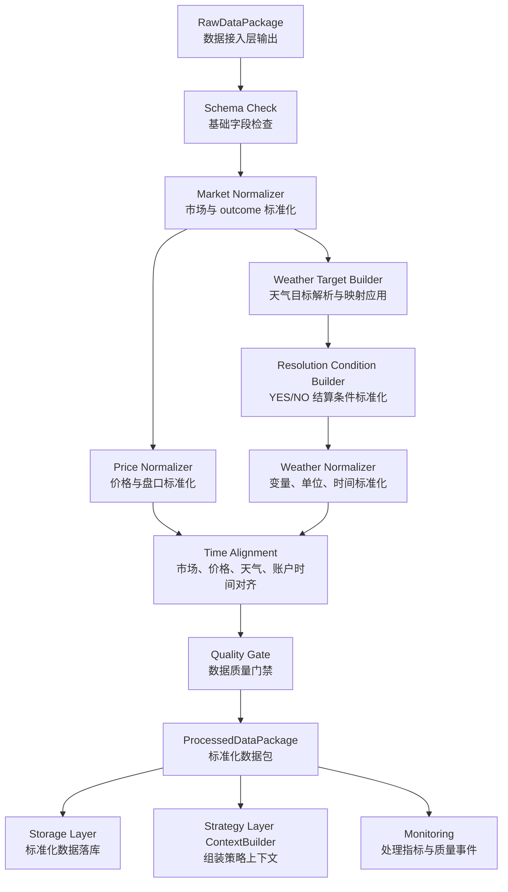
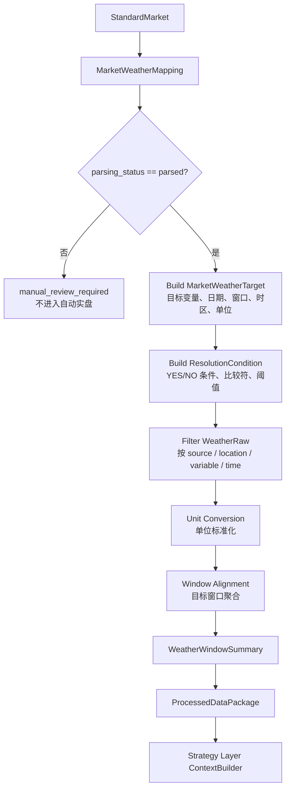
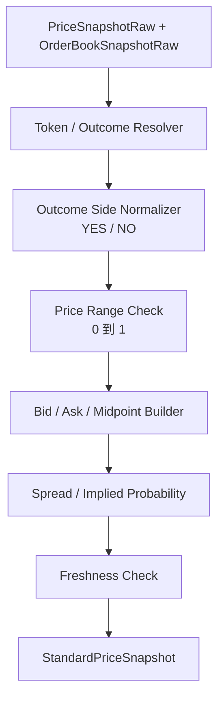

# 数据处理层 PRD

## 1. 文档定位

本文档是 Polymarket 天气 Alpha 量化项目的数据处理层主 PRD，用于明确数据处理层的产品目标、模块边界、MVP 范围、标准化对象、核心流程、质量规则、交付物、验收标准与口径确认记录。

数据处理层的职责是：**把数据接入层交付的 Raw（原始/半结构化）数据，转换成策略层、风控层、回测层、存储层可以稳定消费的标准化数据结构。**

本文档仅进行产品设计，不涉及开发实现。

---

## 2. 背景与目标

项目整体链路是：

```text
数据接入层获取 Raw 数据
        ↓
数据处理层标准化、对齐、质检
        ↓
策略层估计真实概率并生成信号
        ↓
风控层过滤风险
        ↓
执行层模拟或真实下单
        ↓
存储、监控、复盘、迭代
```

数据接入层已经规划输出 `EventRaw`、`MarketRaw`、`PriceSnapshotRaw`、`OrderBookSnapshotRaw`、`PriceHistoryRaw`、`WeatherRaw`、`MarketWeatherMapping`、`AccountSnapshotRaw`、`PositionRaw`、`OrderRaw`、`TradeRaw` 等对象。

数据处理层承接这些 Raw 对象，但不做外部 API 调用、不做概率估计、不做交易判断、不做下单执行。它要解决的问题是：不同来源、不同时间口径、不同单位、不同字段命名的数据，必须在进入策略前变成一致、可追溯、可质检的结构。

### 2.1 产品目标

MVP 阶段目标：

1. 统一 Polymarket event / market / outcome 的字段、状态与标识。
2. 统一 YES / NO 价格、bid / ask / mid price（中间价）、spread（价差）与 implied probability（隐含概率）口径。
3. 统一时间字段、时区、市场截止时间、天气目标时间窗口、预报发布时间与本地拉取时间。
4. 统一城市、站点、经纬度、天气变量、单位与时间窗口。
5. 基于 `MarketWeatherMapping` 将 market 与 weather 数据稳定关联，并标准化天气 market 的结算条件。
6. 对 Raw 数据进行基础质量检查，拆分输出自动策略可用性、观察研究可用性、自动实盘权限与质量事件。
7. 为策略层输出构造 `StrategyContext`（策略上下文）所需的标准化对象。
8. 为存储层输出可落库、可追溯、可复盘的标准化数据包。
9. 为回测层预留历史价格、历史天气、历史映射的标准化口径。

### 2.2 非目标

MVP 阶段暂不做：

1. 不拉取外部数据，外部数据获取归属数据接入层。
2. 不直接读取或写入外部 API。
3. 不估计真实发生概率，概率估计归属策略层。
4. 不做多天气源融合建模。
5. 不做复杂数据质量评分模型。
6. 不决定下单金额、订单价格或是否执行。
7. 不做完整历史回测引擎。
8. 不直接实现数据库 Repository / DAO 细节，数据库访问归属存储层。
9. 不在数据处理层硬编码某一个具体天气市场规则。
10. MVP 不完整标准化订单、成交生命周期；订单、成交的完整视图归属执行层与存储层，数据处理层只保留后续接入扩展位。

---

## 3. 模块边界

### 3.1 数据处理层负责

| 能力 | 说明 |
|---|---|
| Market 标准化 | 统一 event、market、outcome、token、状态、结算时间等字段 |
| Price 标准化 | 统一 YES / NO 价格、bid、ask、midpoint、spread、隐含概率 |
| Time 标准化 | 统一 UTC、resolution timezone（结算时区）、forecast time（预报时间）、observed time（观测时间） |
| Weather 标准化 | 统一天气变量、单位、站点、经纬度、目标日期、时间窗口 |
| Weather Contract 标准化 | 标准化天气 market 的 YES / NO 结算条件、阈值、比较符、边界规则 |
| Mapping 应用 | 使用 `MarketWeatherMapping` 连接 market 与 weather 数据 |
| Position / Account 标准化 | MVP 只统一账户与持仓快照，供策略与风控读取；订单、成交完整标准化延后到 V1 或执行层 |
| 数据质量门禁 | 判断缺字段、过期、口径不明、映射失败、单位缺失等问题，并输出结构化质量事件 |
| 标准化数据交付 | 输出标准化对象与 `ProcessedDataPackage`，供策略层 ContextBuilder 组装上下文 |
| 追溯信息保留 | 保留 source、fetched_at、raw_data_ref、ingestion_run_id、processing_run_id、配置版本与规则版本 |

### 3.2 数据处理层不负责

| 不负责能力 | 归属模块 | 原因 |
|---|---|---|
| 外部 API 拉取 | 数据接入层 | 避免标准化逻辑和数据源耦合 |
| 结算规则原文抓取 | 数据接入层 | 接入层负责获取与保留 rules 原文 |
| 概率估计 | 策略层 | 数据处理层只准备输入，不做 alpha 判断 |
| 交易信号生成 | 策略层 | 避免数据层耦合交易意图 |
| 风控过滤 | 风控层 | 数据处理层只输出质量状态 |
| 下单、撤单、订单生命周期 | 执行层 | 资金操作必须和数据标准化分离 |
| 数据库表结构与迁移 | 存储层 | 数据处理层只定义标准对象与写入要求 |
| 通知推送 | 通知与监控层 | 数据处理层只输出状态和质量事件 |

---

## 4. MVP 范围

### 4.1 必做能力

#### 4.1.1 Market 标准化

MVP 必须把 `EventRaw`、`MarketRaw` 转成统一 market 结构。

标准化内容：

| 标准化项 | 说明 |
|---|---|
| market_id | 保留 Polymarket market ID |
| event_id | 保留所属 event ID |
| question | 保留市场题干 |
| rules_ref | 保留结算规则原文引用 |
| outcomes | 标准化 outcome 列表 |
| token_ids | outcome token ID 列表 |
| market_type | 市场类型，例如 weather、non_weather，来源于标签、规则或映射 |
| status | 标准状态，例如 active、closed、resolved、unknown |
| tradable | 是否从数据质量角度可进入策略判断，不等于最终可交易 |
| end_time_utc | 市场结束时间，统一 UTC |
| resolution_time_utc | 可结算时间，若可获得则统一 UTC |
| source | 数据来源 |
| fetched_at | 数据拉取时间 |

处理原则：

1. 不丢弃原始 question、description、rules 引用。
2. status 字段必须与 Polymarket 原始 active / closed / resolved 有可追溯映射。
3. 对天气 market，如果没有有效 `MarketWeatherMapping`，不得标记为可自动实盘。

#### 4.1.2 Outcome 标准化

MVP 优先支持二元 YES / NO 市场。

标准化内容：

| 字段 | 说明 |
|---|---|
| outcome_id | 内部 outcome 标识 |
| market_id | 所属 market |
| token_id | Polymarket outcome token ID |
| raw_outcome | 原始 outcome 文本 |
| normalized_outcome | 标准 outcome，MVP 为 YES / NO |
| side | YES / NO |
| is_supported | 当前系统是否支持该 outcome |

处理原则：

1. YES / NO 的 token 映射必须明确。
2. 如果 outcome 数量不是 2，或无法确定 YES / NO token，对该 market 标记 `unsupported_outcome_structure`。
3. 不在数据处理层猜测模糊 outcome 的交易方向。

#### 4.1.3 价格与概率标准化

MVP 必须把 `PriceSnapshotRaw` 和 `OrderBookSnapshotRaw` 转成策略可直接读取的价格结构。

标准化内容：

| 字段 | 说明 |
|---|---|
| market_id | market ID |
| token_id | outcome token ID |
| outcome_side | outcome 方向，标准为 YES / NO |
| order_side | 订单方向语义，标准为 BUY / SELL；价格快照中通常为空或作为派生可成交口径说明 |
| best_bid | 最优买价 |
| best_ask | 最优卖价 |
| mid_price | 中间价 |
| last_price | 当前或最近价格，若数据源提供 |
| spread | 价差 |
| executable_buy_price | 买入该 outcome 的可成交参考价，通常来自 best_ask |
| executable_sell_price | 卖出该 outcome 的可成交参考价，通常来自 best_bid |
| implied_probability_mid | 基于 mid_price 的隐含概率 |
| implied_probability_bid | 基于 best_bid 的隐含概率 |
| implied_probability_ask | 基于 best_ask 的隐含概率 |
| price_source | price / midpoint / orderbook 等来源说明 |
| price_basis | bid / ask / mid / last / derived，用于说明下游默认读取口径 |
| derived | 是否派生 |
| derived_from | 派生来源，例如 bid_ask |
| source_timestamp | 数据源时间 |
| fetched_at | 本地拉取时间 |
| is_stale | 是否过期 |

处理原则：

1. 所有价格必须归一到 0 到 1 区间。
2. `best_bid <= best_ask` 是基础质量规则；不满足时标记异常。
3. mid price（中间价）优先来自数据源；缺失时允许由 bid / ask 计算，但必须显式记录 `derived=true` 与 `derived_from=bid_ask`。
4. MVP 不允许用 `1 - other_side` 自动派生缺失侧价格；YES / NO 某一侧价格缺失时，应标记 `missing_side_price`。
5. 如未来确需基于互补关系推导价格，只能作为 `derived_reference_price`（派生参考价），不得作为 executable price（可成交价格）或默认 implied probability（隐含概率）。
6. 数据处理层只计算 market implied probability（市场隐含概率），不计算真实概率。
7. `outcome_side`（YES / NO）与 `order_side`（BUY / SELL）必须分开表达，禁止用单一 `side` 字段混用两种语义。
8. 简单策略默认读取哪一个价格口径必须由策略层或 ContextBuilder 显式选择，数据处理层只提供可追溯的候选价格口径。
9. 数据处理层不启用 `max_spread_for_strategy` 作为策略前阻断门禁；数据处理层只负责计算并输出 spread、盘口深度、流动性摘要，以及识别非法盘口。
10. 价差阈值、盘口深度阈值、流动性阈值等交易性过滤规则归属风控层。

#### 4.1.4 Orderbook 摘要标准化

MVP 不做历史订单簿重建，但需要把当前订单簿快照转成策略和风控可用摘要。

最小摘要：

| 字段 | 说明 |
|---|---|
| market_id | market ID |
| token_id | outcome token ID |
| outcome_side | outcome 方向，标准为 YES / NO |
| best_bid | 最优买价 |
| best_ask | 最优卖价 |
| spread | 价差 |
| midpoint | 中间价 |
| bid_depth | 买盘深度摘要 |
| ask_depth | 卖盘深度摘要 |
| depth_levels | 使用的档位数量 |
| min_order_size | 最小订单数量 |
| tick_size | 最小价格单位 |
| snapshot_id | 原始快照 ID |
| source_timestamp | 数据源时间 |
| fetched_at | 本地拉取时间 |

处理原则：

1. MVP 至少输出 best bid / best ask / spread / midpoint。
2. 深度摘要只做结构化整理，不做成交模拟。
3. 完整订单簿明细可通过 raw_data_ref 追溯，不强制在标准对象中展开全部档位。

#### 4.1.5 时间与时区标准化

MVP 必须统一时间口径，避免市场时间、天气时间和本地运行时间混用。

标准时间字段：

| 字段 | 说明 |
|---|---|
| event_time_utc | 事件相关时间 UTC |
| market_end_time_utc | market 结束时间 UTC |
| resolution_time_utc | 可结算或目标结果时间 UTC |
| target_date_local | 天气结算目标日期，按 resolution timezone |
| target_window_local | 天气结算目标时间窗口，按本地结算时区 |
| target_window_utc | 天气结算目标时间窗口 UTC |
| forecast_run_time_utc | 预报模型运行时间 UTC |
| forecast_time_utc | 预报对应时间 UTC |
| observed_time_utc | 观测对应时间 UTC |
| fetched_at_utc | 本地拉取时间 UTC |
| processed_at_utc | 数据处理时间 UTC |
| data_available_at_utc | 下游可见该数据的时间 UTC，用于回测防未来函数 |
| as_of_time_utc | 回测或复盘视角下的“当时可见时间” UTC |

处理原则：

1. 系统内部时间统一使用 UTC。
2. 天气结算窗口必须保留 local timezone（本地时区）语义。
3. 如果 `MarketWeatherMapping.timezone` 缺失，天气 market 不进入自动实盘。
4. 如果时间窗口无法解析，标记 `target_window_unparsed`，不得自行猜测。
5. 实时处理时 `as_of_time_utc` 默认等于本轮 `processed_at_utc`；回测或 replay（回放）时必须由回测层传入，数据处理层只能使用 `data_available_at_utc <= as_of_time_utc` 的数据。

#### 4.1.6 天气变量与单位标准化

MVP 必须把 `WeatherRaw` 统一成标准天气点或标准天气窗口。

标准化内容：

| 标准项 | 说明 |
|---|---|
| variable | 标准变量名，例如 max_temperature、min_temperature、precipitation_sum、snowfall_sum、wind_speed_max |
| raw_variable | 原始变量名 |
| value | 标准化后的数值 |
| raw_value | 原始数值 |
| unit | 标准单位 |
| raw_unit | 原始单位 |
| provider_type | forecast / observation / resolution_evidence |
| source | 数据源 |
| model | 预报模型 |
| run_time_utc | 模型运行时间 |
| valid_time_utc | 预报或观测对应时间 |
| location_id | 内部位置 ID |
| station_id | 站点 ID，若适用 |
| lat / lon | 经纬度 |

MVP 标准变量建议：

| 标准变量 | 说明 |
|---|---|
| max_temperature | 最高温 |
| min_temperature | 最低温 |
| temperature | 某时刻温度 |
| precipitation_sum | 累计降水 |
| rainfall_sum | 累计降雨 |
| snowfall_sum | 累计降雪 |
| wind_speed | 风速 |
| wind_speed_max | 最大风速 |
| wind_gust_max | 最大阵风 |

处理原则：

1. 单位换算必须可追溯，保留 raw value（原始值）与 raw unit（原始单位）。
2. 天气结算单位优先来自 `MarketWeatherMapping.unit`。
3. 若目标单位缺失，不进行自动单位猜测，标记 `unit_missing`。
4. MVP 可做基础单位换算，例如 °F / °C、inch / mm、mph / km/h；具体换算清单需在开发设计阶段明确。

#### 4.1.7 Market 与 Weather 对齐

MVP 必须基于 `MarketWeatherMapping` 将 market、天气目标、预报数据、观测数据对齐。

对齐产出：

| 对象 | 说明 |
|---|---|
| MarketWeatherTarget | market 对应的标准天气目标 |
| StandardWeatherPoint | 标准化后的预报、观测与结算证据天气点 |
| WeatherWindowSummary | 目标窗口聚合后的天气摘要 |
| primary_forecast_summary_id | 按配置选出的主预报窗口摘要 ID，供简单策略优先使用 |

处理原则：

1. `parsing_status != parsed` 的 mapping 不进入自动实盘上下文。
2. 时间窗口解析失败时，不对天气数据做聚合猜测。
3. forecast source（预测来源）与 resolution source（结算来源）必须同时保留，不能强行等同。
4. 对多个预报模型或多个 run_time 的数据，MVP 至少保留全部标准化天气点与窗口聚合摘要，不删除、覆盖或隐藏其他 forecast。
5. 数据处理层可以按配置标记一个 `primary_forecast_summary_id`，指向默认 forecast provider（预测数据提供者）、model（模型）和 run_time 选择出的窗口摘要；该默认选择必须可配置。
6. 简单策略可以优先使用 `primary_forecast_summary_id` 对应的摘要，复杂 forecast 视图、点级对齐解释和模型分歧分析延后到 V1。
7. 无 observation（观测）数据但有 forecast（预报）数据时，允许 market 进入策略；数据处理层应标记 `forecast_only` 或 `observation_lagging`，不因观测数据暂未更新而阻断。
8. observation 天然可能滞后于目标时点发布，例如 3:00 的时点数据可能到 3:05 左右才在数据源更新，数据处理层不得在 3:01 仅因缺少 3:00 observation 就阻断 market。

MVP 天气窗口聚合默认规则：

| 标准变量 | 默认聚合方式 | 说明 |
|---|---|---|
| max_temperature | max | 目标窗口内取最高温 |
| min_temperature | min | 目标窗口内取最低温 |
| precipitation_sum | sum | 目标窗口内累计降水 |
| rainfall_sum | sum | 目标窗口内累计降雨 |
| snowfall_sum | sum | 目标窗口内累计降雪 |
| wind_speed_max | max | 目标窗口内取最大风速 |
| wind_gust_max | max | 目标窗口内取最大阵风 |
| temperature_at_time | exact_or_nearest | 指定时点值，优先精确时点，缺失时取最近时点并标记 |

`WeatherWindowSummary` 必须记录：

| 字段 | 说明 |
|---|---|
| aggregation_method | 聚合方法，例如 max / min / sum / exact_or_nearest |
| window_start_local | 本地时间窗口开始 |
| window_end_local | 本地时间窗口结束 |
| timezone | 聚合使用的时区 |
| source_points_count | 实际参与聚合的数据点数量 |
| expected_points_count | 目标窗口理论应有数据点数量 |
| coverage_ratio | 数据覆盖率 |
| min_required_coverage_ratio | 配置要求的最小覆盖率 |
| nearest_point_offset_minutes | exact_or_nearest 使用最近点时的偏移分钟数 |
| window_boundary_policy | 时间窗口边界策略，例如 left_closed_right_open |
| aggregation_policy_version | 聚合规则版本 |
| raw_points_ref | 原始天气点引用 |

聚合规则要求：

1. 聚合窗口必须来自 `MarketWeatherMapping.target_time_window` 与 `timezone`。
2. 如果时间窗口无法解析，不做聚合猜测，标记 `skipped_unparsed_time_window`。
3. 聚合规则必须可配置，后续可按 market 或变量覆盖默认规则。
4. `exact_or_nearest` 必须配置最大允许偏移；超出容忍范围时不得取最近点，应输出质量事件。
5. 聚合必须记录窗口边界策略，MVP 默认建议采用 `[start, end)`（左闭右开）。
6. 若 `coverage_ratio` 低于配置阈值，应输出 `weather_low_coverage` 质量事件；是否阻断由质量策略配置决定。
7. daily（逐日）与 hourly（逐小时）数据同时存在时，优先级必须由配置决定，不得在实现中隐式选择。
8. 降水、降雪、风速等变量必须在开发设计中明确 source variable（源变量）语义，例如小时增量、累计量、snow depth（积雪深度）或 snowfall（降雪量）。

#### 4.1.8 天气结算条件标准化

MVP 必须把天气 market 的 YES / NO 结算条件标准化为策略可理解的 contract（合约条件）对象。该对象不估计真实概率，只描述 market 规则本身。

标准化对象建议为 `StandardResolutionCondition`。

| 字段 | 说明 |
|---|---|
| market_id | market ID |
| condition_id | 内部条件 ID |
| target_variable | 标准天气变量 |
| raw_condition_text | 从 question / rules 中提取的原始条件文本 |
| yes_condition_text | YES 对应的原始条件文本 |
| no_condition_text | NO 对应的原始条件文本 |
| operator | 比较符，例如 gt / gte / lt / lte / eq / between |
| threshold_value | 单阈值条件的标准单位数值 |
| lower_bound | 区间条件下界 |
| upper_bound | 区间条件上界 |
| inclusive_policy | 边界是否包含，例如 lower_inclusive / upper_inclusive |
| unit | 条件使用的标准单位 |
| raw_unit | 条件原始单位 |
| rounding_policy | 四舍五入或取整规则，若 rules 明确给出则必须保留 |
| precision | 结算精度，例如整数、1 位小数等 |
| tie_policy | 平局、等于阈值、缺测、官方修正等边界规则 |
| edge_case_rules_ref | 边界规则原文引用 |
| resolution_source_name | 结算来源名称 |
| resolution_source_url | 结算来源 URL |
| parsing_status | parsed / manual_review / failed |

处理原则：

1. 策略层判断概率前必须能明确 YES 对应什么条件成立。
2. 天气 market 如果无法解析出 `operator`、阈值或 YES / NO 条件方向，不得进入自动实盘。
3. 对 `between`（区间）类 market，必须同时保留上下界与边界包含规则。
4. 对等于阈值、四舍五入、官方修正、缺测替代等 edge case（边界情况），数据处理层只结构化记录，不自行创造规则。
5. `StandardMarketWeatherTarget` 必须引用 `StandardResolutionCondition`，避免只有天气窗口而没有结算条件。

#### 4.1.9 账户与持仓标准化

MVP 必须把账户与持仓相关 Raw 对象整理为策略与风控可读结构。订单和成交生命周期更靠近执行层与存储层，MVP 数据处理层不做完整标准化。

最小标准化对象：

| 对象 | 核心字段 |
|---|---|
| AccountSnapshot | account_id / wallet_address、cash_balance、total_value、fetched_at、is_stale |
| PositionSnapshot | market_id、token_id、side、size、avg_price、current_price、unrealized_pnl、fetched_at |

处理原则：

1. side 必须统一到 BUY / SELL 与 YES / NO 两组口径，不混用。
2. 账户数据过期时，应标记 `account_stale` 质量事件，不直接阻断 market 的 `strategy_eligible=true`。
3. 账户数据过期时，必须设置 `auto_trading_allowed=false`；风控层 / 执行层必须在账户快照刷新成功后才允许真实交易。
4. 数据处理层不计算最终仓位上限，不做资金分配。

#### 4.1.10 数据质量门禁

MVP 必须输出每个 market 的数据质量状态、质量事件、自动策略可用性、观察研究可用性与自动实盘权限。

质量报告建议结构：

| 字段 | 说明 |
|---|---|
| market_id | market ID |
| quality_status | ready / warning / blocked / manual_review / unsupported |
| strategy_eligible | 是否允许进入自动策略判断 |
| research_eligible | 是否允许进入 observation / research（观察 / 研究）上下文 |
| auto_trading_allowed | 是否允许进入真实交易链路 |
| quality_events | 结构化质量事件列表 |
| primary_blocking_reason | 主阻断原因，若无则为空 |
| generated_at | 质量报告生成时间 |

`QualityEvent` 建议结构：

| 字段 | 说明 |
|---|---|
| code | 事件代码，例如 missing_price / forecast_only / account_stale |
| severity | info / warning / blocking / live_blocking |
| reason | 人类可读原因 |
| source_object | 关联对象，例如 price / weather / mapping / account |
| field | 关联字段，若适用 |
| raw_data_ref | 原始数据引用，若适用 |

建议事件代码：

| 状态 | 说明 |
|---|---|
| ready | 数据处理层认为可交给策略判断，属于 `quality_status` 而不是质量事件 |
| manual_review_required | 需要人工确认，例如结算来源不明确 |
| skipped_missing_price | 缺少价格 |
| skipped_missing_orderbook | 缺少订单簿或盘口 |
| skipped_missing_weather | 缺少天气数据 |
| skipped_stale_data | 数据过期 |
| skipped_unparsed_time_window | 时间窗口无法解析 |
| skipped_unsupported_outcome | outcome 结构不支持 |
| skipped_unit_missing | 单位缺失或无法换算 |
| skipped_mapping_failed | market-weather 映射失败 |
| forecast_only | 有 forecast 但暂无 observation，允许进入策略 |
| observation_lagging | 目标时点附近 observation 可能尚未发布，允许进入策略 |
| account_stale | 账户数据过期，允许观察和策略研究，但禁止自动实盘 |

处理原则：

1. 数据质量状态必须带 reason（原因）。
2. 被跳过的 market 也要进入处理报告，方便复盘。
3. 数据质量门禁只判断“数据是否足以进入策略”，不判断“是否值得交易”。
4. 被质量门禁跳过的 market 仍应输出观察用标准化数据包和 `MarketDataQualityReport`。
5. 被跳过自动策略的 market 必须标记 `quality_status != ready`、`strategy_eligible=false`，并设置 `auto_trading_allowed=false`；是否保留观察上下文由 `research_eligible` 决定。
6. `forecast_only`、`observation_lagging` 属于 warning（警告）事件，不应单独阻断策略。
7. `account_stale` 属于 live_blocking（实盘阻断）事件，不应单独阻断策略研究，但必须设置 `auto_trading_allowed=false`。
8. `mapping_unparsed`、`skipped_unparsed_time_window`、`manual_review_required` 等人工复核类事件必须使 `strategy_eligible=false`、`research_eligible=true`、`auto_trading_allowed=false`。
9. 策略层可以基于 `research_eligible=true` 的标准化对象组装 observation / research（观察 / 研究）用上下文，但不得进入自动实盘执行链路。

### 4.2 暂缓能力

MVP 暂缓以下能力：

1. 多天气源融合后的单一 consensus forecast（共识预报）。
2. 复杂 bias correction（偏差校准）。
3. 历史订单簿重建与盘口回放。
4. 多 outcome 市场完整支持。
5. 自动解析所有 Polymarket 天气规则的自然语言。
6. 数据质量评分模型和权重体系。
7. 图形化人工复核工作台。
8. 完整订单、成交生命周期标准化。
9. forecast / observation 点级对齐解释对象与多模型分歧分析。

---

## 5. 输入与输出

### 5.1 输入对象

数据处理层的主要输入来自数据接入层：

| 输入对象 | 用途 |
|---|---|
| EventRaw | 事件标准化 |
| MarketRaw | market 与 outcome 标准化 |
| PriceSnapshotRaw | 当前价格标准化 |
| OrderBookSnapshotRaw | 盘口与流动性摘要 |
| PriceHistoryRaw | 历史价格标准化，供复盘/回测 |
| WeatherRaw | 预报、观测、结算证据标准化 |
| MarketWeatherMapping | market 与天气目标映射 |
| AccountSnapshotRaw | 账户快照标准化 |
| PositionRaw | 持仓标准化 |
| OrderRaw | MVP 仅保留输入扩展位；完整订单状态标准化延后 |
| TradeRaw | MVP 仅保留输入扩展位；完整成交记录标准化延后 |

### 5.2 输出对象

MVP 推荐输出：

| 输出对象 | 下游用途 |
|---|---|
| ProcessedDataPackage | 一次处理运行的总输出包 |
| StandardMarket | 标准 market 对象 |
| StandardOutcome | 标准 outcome 对象 |
| StandardPriceSnapshot | 标准价格快照 |
| StandardOrderBookSummary | 标准盘口摘要 |
| StandardPriceHistory | 标准历史价格点 |
| StandardWeatherPoint | 标准天气点 |
| WeatherWindowSummary | 天气目标窗口摘要 |
| StandardMarketWeatherTarget | market-weather 标准目标 |
| StandardResolutionCondition | 天气 market 的 YES / NO 结算条件 |
| AccountSnapshot | 标准账户快照 |
| PositionSnapshot | 标准持仓快照 |
| MarketDataQualityReport | market 数据质量报告 |
| StrategyContext 构造素材 | 数据处理层不直接构造最终上下文，但输出策略层组装上下文所需的标准对象 |

### 5.3 ProcessedDataPackage

`ProcessedDataPackage` 是数据处理层每轮运行的主交付对象。

产品层字段：

| 字段 | 说明 |
|---|---|
| processing_run_id | 本轮处理运行 ID |
| ingestion_run_id | 来源接入运行 ID |
| run_context | 从接入层继承并补充的运行上下文 |
| started_at | 处理开始时间 |
| completed_at | 处理完成时间 |
| processing_mode | live / dry_run / backtest / research |
| live_trading_allowed | 本轮处理输出是否允许进入实盘链路 |
| processing_config_version | 数据处理配置版本或摘要 |
| processing_rules_version | 标准化规则版本 |
| normalizer_versions | 各 normalizer（标准化器）版本 |
| quality_policy_version | 质量门禁规则版本 |
| input_raw_package_ref | 输入 RawDataPackage 引用 |
| input_raw_package_hash | 输入 RawDataPackage 摘要，用于重跑校验 |
| markets | 标准 market 列表 |
| outcomes | 标准 outcome 列表 |
| prices | 标准价格快照 |
| orderbooks | 标准订单簿摘要 |
| price_history | 标准历史价格 |
| weather_points | 标准天气点 |
| weather_windows | 天气窗口摘要 |
| market_weather_targets | 标准 market-weather 目标 |
| resolution_conditions | 标准天气结算条件 |
| accounts | 标准账户快照 |
| positions | 标准持仓 |
| quality_reports | 数据质量报告 |
| errors | 处理错误列表 |
| metrics | 处理指标 |

要求：

1. 可序列化。
2. 保留 Raw 数据追溯字段。
3. 可批量写入存储层。
4. 支持部分 market 失败，成功 market 继续输出。
5. 同一 RawDataPackage 使用同一 `processing_rules_version` 重跑时，输出应具备幂等性；不同输入内容即使规则版本相同，也必须通过 input hash（输入哈希）保留可追溯差异。
6. 不同 `processing_rules_version` 或 `quality_policy_version` 重算时，应作为新版本输出，不覆盖旧版本。

### 5.4 StrategyContext 边界

`StrategyContext` 是策略层做判断时使用的上下文对象。不同策略可能需要不同数据视角，因此 MVP 确认采用以下边界：

```text
数据处理层输出构造 StrategyContext 所需的标准化对象；
StrategyContext 由策略层或策略层下的 ContextBuilder 根据具体策略需求组装。
```

数据处理层需要保证以下标准对象足够完整、稳定、可追溯：

| 字段 | 说明 |
|---|---|
| market | `StandardMarket` |
| outcomes | `StandardOutcome[]` |
| prices | `StandardPriceSnapshot[]` |
| orderbook | `StandardOrderBookSummary`，可为空 |
| weather_target | `StandardMarketWeatherTarget`，天气 market 必填 |
| resolution_condition | `StandardResolutionCondition`，天气 market 必填 |
| weather | `WeatherWindowSummary` 或相关 `StandardWeatherPoint[]` |
| position | `PositionSnapshot`，可为空 |
| account | `AccountSnapshot`，可为空 |
| data_quality | `MarketDataQualityReport`，包含 `strategy_eligible`、`research_eligible`、`auto_trading_allowed` |

硬性约束：

1. 数据处理层不定义所有策略共用的固定 `StrategyContext`。
2. 策略层的 ContextBuilder 只能消费数据处理层输出的标准化对象，不直接消费 Raw 数据或外部 API 裸响应。
3. `data_quality.strategy_eligible=false` 的 market 不应进入自动策略上下文。
4. `data_quality.research_eligible=true` 且 `auto_trading_allowed=false` 的 market 可以进入 observation / research（观察 / 研究）上下文，但不得进入真实执行链路。
5. 策略如需追溯原始数据，应通过 `raw_data_ref` 或存储层查询，而不是依赖 Raw payload。

---

## 6. 核心流程

### 6.1 一次数据处理流程



### 6.2 天气 market 对齐流程



### 6.3 价格标准化流程



---

## 7. 数据质量与错误处理

### 7.1 质量检查规则

MVP 必做检查：

| 检查项 | 失败状态 |
|---|---|
| market_id 缺失 | skipped_schema_error |
| outcome token 映射失败 | skipped_unsupported_outcome |
| YES / NO 不明确 | skipped_unsupported_outcome |
| 天气结算条件无法解析 | manual_review_required |
| YES / NO 条件方向不明确 | manual_review_required |
| price 缺失 | skipped_missing_price |
| price 不在 0 到 1 | skipped_invalid_price |
| best_bid > best_ask | skipped_invalid_orderbook |
| price / orderbook 过期 | skipped_stale_data |
| MarketWeatherMapping 缺失 | skipped_mapping_failed |
| parsing_status != parsed | manual_review_required |
| timezone 缺失 | skipped_timezone_missing |
| 时间窗口无法解析 | skipped_unparsed_time_window |
| 天气变量缺失 | skipped_missing_weather |
| 单位缺失或无法换算 | skipped_unit_missing |
| 账户快照过期 | account_stale |

质量检查输出不得只给一个字符串状态。每条失败、警告或实盘阻断都必须转换为 `QualityEvent`，并最终汇总出 `quality_status`、`strategy_eligible` 与 `auto_trading_allowed`。

### 7.2 错误类型

| 错误类型 | 说明 |
|---|---|
| ProcessingSchemaError | 输入对象缺少必要字段 |
| OutcomeMappingError | outcome 与 token 映射失败 |
| TimeNormalizationError | 时间或时区标准化失败 |
| UnitConversionError | 单位换算失败 |
| WeatherAlignmentError | 天气数据无法和目标窗口对齐 |
| PriceNormalizationError | 价格字段非法或冲突 |
| ResolutionConditionError | 天气结算条件无法标准化 |
| DataQualityError | 数据质量门禁失败 |
| PartialProcessingError | 部分 market 处理失败 |

### 7.3 降级策略

| 场景 | MVP 行为 |
|---|---|
| 单个 market 标准化失败 | 跳过该 market，记录质量报告 |
| 单个天气窗口对齐失败 | 该 market 不进入策略 |
| 单个价格异常 | 该 market 不进入策略 |
| 账户数据异常 | 输出账户质量事件；账户过期等不满足真实交易条件的场景必须禁止自动实盘 |
| 历史价格部分失败 | 保留成功点，记录失败点 |
| RawDataPackage 整体结构异常 | 本轮处理失败，不输出标准化数据包 |

### 7.4 数据新鲜度规则

不同数据类型必须使用不同 freshness（数据新鲜度）口径，不能只用单一 `processed_at - fetched_at` 判断。

| 数据类型 | 推荐判断口径 | 过期处理 |
|---|---|---|
| market | `processed_at_utc - fetched_at_utc` 或 source updated time | 可进入观察，必要时标记 stale |
| price | `processed_at_utc - source_timestamp` | 过期 market 不进入策略 |
| orderbook | `processed_at_utc - source_timestamp` | 过期 market 不进入策略 |
| account | `processed_at_utc - fetched_at_utc` | 不阻断策略研究，但 `auto_trading_allowed=false` |
| forecast | `processed_at_utc - forecast_run_time_utc`，同时检查 valid_time 是否覆盖目标窗口 | 缺失或过期时不进入策略 |
| observation | `processed_at_utc - observed_time_utc`，允许配置 observation lag（观测发布滞后） | 仅因合理滞后缺失时标记 warning，不阻断策略 |
| mapping | `mapping.updated_at` 与当前 rules 引用是否匹配 | 失配或过期时 manual_review |

`FreshnessResult` 至少应记录：

| 字段 | 说明 |
|---|---|
| data_type | 数据类型 |
| market_id | market ID，可为空 |
| reference_time_utc | 用于判断新鲜度的基准时间 |
| source_timestamp_utc | 数据源时间 |
| fetched_at_utc | 本地拉取时间 |
| max_age_seconds | 最大允许年龄 |
| lag_allowance_seconds | 允许发布滞后的秒数 |
| is_stale | 是否过期 |
| reason | 判断原因 |

### 7.5 幂等与重跑规则

数据处理层必须支持重试、回补和规则升级后的重跑。

建议幂等键：

| 标准对象 | 建议幂等键 |
|---|---|
| StandardMarket | `source + market_id + input_object_hash + processing_rules_version` |
| StandardOutcome | `market_id + token_id + processing_rules_version` |
| StandardPriceSnapshot | `source + market_id + token_id + source_timestamp 或 fetched_at + input_object_hash + processing_rules_version` |
| StandardOrderBookSummary | `source + market_id + token_id + snapshot_id 或 source_timestamp + input_object_hash + processing_rules_version` |
| StandardPriceHistory | `source + market_id + token_id + timestamp + fidelity + processing_rules_version` |
| StandardWeatherPoint | `source + provider_type + model + run_time + valid_time + location_id + variable + processing_rules_version` |
| WeatherWindowSummary | `market_id + provider + model + run_time + window_start_utc + window_end_utc + variable + aggregation_policy_version` |
| StandardResolutionCondition | `market_id + rules_ref + condition_input_hash + processing_rules_version` |
| MarketDataQualityReport | run-level 使用 `processing_run_id + market_id`；可重算报告使用 `market_id + input_package_hash + quality_policy_version` |

重跑原则：

1. 同一输入、同一规则版本重跑，不应产生不可控重复数据。
2. 不同 `processing_rules_version`、`aggregation_policy_version` 或 `quality_policy_version` 重算，应保留为新版本结果，不覆盖旧结果。
3. 存储层负责最终落库幂等实现，数据处理层必须提供足够的幂等键字段。
4. 没有 source timestamp（源时间戳）的快照对象，必须使用 `fetched_at` 与输入对象 hash 作为 fallback（兜底）口径。

### 7.6 敏感信息与脱敏

数据处理层会处理账户与持仓等敏感数据，必须区分数据等级。

| 等级 | 示例 | 处理要求 |
|---|---|---|
| public | market_id、公开价格、公开天气数据 | 可进入标准对象、指标和普通日志 |
| sensitive | wallet_address、account_id、balance、position、order_id、trade_id | 可进入受控标准对象和受控存储；日志、错误、指标默认脱敏 |
| secret | API key、private key、签名材料 | 不应进入数据处理层输入、输出、日志或错误对象 |

要求：

1. `ProcessedDataPackage` 默认只包含脱敏账户视图；完整敏感字段只能进入受控存储输出。
2. 错误对象不得包含完整认证 header、签名 payload、API key 或 private key。
3. 日志中如需输出 wallet address（钱包地址），默认只输出脱敏形式。

---

## 8. 配置需求

MVP 阶段需要统一配置入口。配置项只描述数据处理规则，不包含 API 密钥。

### 8.1 时间配置

| 配置项 | 说明 |
|---|---|
| internal_timezone | 系统内部时区，固定 UTC |
| default_market_timezone_policy | market 无时区时的处理策略 |
| require_resolution_timezone | 天气 market 是否必须有结算时区 |
| max_price_age_seconds | 价格最大允许年龄 |
| max_orderbook_age_seconds | 订单簿最大允许年龄 |
| max_account_age_seconds | 账户快照最大允许年龄 |
| max_forecast_run_age_seconds | forecast run 最大允许年龄 |
| observation_lag_allowance_seconds | observation 合理发布滞后容忍时间 |
| as_of_time_policy | 实时、回测、replay 模式下 `as_of_time_utc` 的来源策略 |

### 8.2 价格配置

| 配置项 | 说明 |
|---|---|
| price_range_min | 最小合法价格，MVP 为 0 |
| price_range_max | 最大合法价格，MVP 为 1 |
| midpoint_policy | midpoint 缺失时允许从 bid / ask 派生，但必须显式标记 derived（派生） |
| allow_complement_price_derivation | MVP 固定为 false，不允许用 `1 - other_side` 自动派生缺失侧价格 |
| max_spread_for_strategy | 不属于数据处理层配置；价差阈值等交易性过滤规则归属风控层 |
| default_price_basis_for_context | 可选，仅作为 ContextBuilder 参考；数据处理层不替策略选择交易价格 |

### 8.3 天气配置

| 配置项 | 说明 |
|---|---|
| standard_temperature_unit | 标准温度单位，MVP 确认为 °C |
| standard_precipitation_unit | 标准降水单位，MVP 确认为 mm |
| standard_wind_speed_unit | 标准风速单位，MVP 确认为 km/h |
| require_target_unit | 是否要求 mapping 中必须有目标单位 |
| weather_window_aggregation_policy | 小时数据聚合到目标窗口的规则；MVP 默认按变量固定规则，且支持后续按 market 或变量覆盖 |
| aggregation_policy_version | 天气窗口聚合规则版本 |
| min_weather_coverage_ratio | 天气窗口最小覆盖率，低于该值标记质量事件 |
| nearest_time_tolerance_minutes | `exact_or_nearest` 的最大允许偏移 |
| window_boundary_policy | 时间窗口边界策略，例如 left_closed_right_open |
| daily_vs_hourly_precedence | daily 与 hourly 同时存在时的优先级 |
| allow_forecast_without_observation | MVP 固定为 true；无观测数据但有预报数据时允许进入策略，并标记 forecast_only / observation_lagging |
| primary_forecast_provider | 主预报摘要默认使用哪个 forecast provider，例如 Open-Meteo |
| primary_forecast_model | 主预报摘要默认使用哪个 forecast model，例如 GFS |
| primary_forecast_run_time_policy | 多个 run_time 存在时的摘要选择策略，例如 latest_available（最新可用） |

### 8.4 质量与版本配置

| 配置项 | 说明 |
|---|---|
| processing_config_version | 数据处理配置版本或配置摘要 |
| processing_rules_version | 标准化规则版本 |
| quality_policy_version | 质量门禁规则版本 |
| quality_event_severity_map | 质量事件到 severity（严重程度）的映射 |
| live_blocking_event_codes | 会导致 `auto_trading_allowed=false` 的事件代码 |
| strategy_blocking_event_codes | 会导致 `strategy_eligible=false` 的事件代码 |
| research_blocking_event_codes | 会导致 `research_eligible=false` 的事件代码；MVP 默认少于 strategy 阻断集合 |

### 8.5 输出配置

| 配置项 | 说明 |
|---|---|
| emit_skipped_market_report | 是否输出被跳过 market 报告 |
| emit_holdout_context | MVP 固定为 true；被质量门禁跳过的 market 仍输出观察用标准化数据包 |
| persist_processed_package | 是否交给存储层保存完整处理包 |
| bundle_output_mode | 输出单 market 标准化数据包还是批量标准化数据包 |
| emit_sensitive_account_fields | 是否在受控存储输出中包含账户敏感字段；MVP 默认 false，日志和 metrics 始终脱敏 |

---

## 9. 与下游模块的交付

### 9.1 给策略层

交付：

1. `StandardMarket`。
2. `StandardOutcome`。
3. `StandardPriceSnapshot`。
4. `StandardOrderBookSummary`。
5. `StandardMarketWeatherTarget`。
6. `StandardResolutionCondition`。
7. `WeatherWindowSummary`。
8. `AccountSnapshot`。
9. `PositionSnapshot`。
10. `MarketDataQualityReport`，包含 `quality_status`、`strategy_eligible`、`research_eligible`、`auto_trading_allowed` 与 `quality_events`。
11. 构造 `StrategyContext` 所需的追溯字段与质量状态。

约束：

```text
Strategy 不直接读取 RawDataPackage
Strategy 不直接调用外部 API
Strategy 不直接做单位换算
Strategy 不直接解析 Polymarket rules 原文
StrategyContext 由策略层或策略层下的 ContextBuilder 组装
```

### 9.2 给风控层

交付：

1. 标准价格、价差、盘口摘要。
2. 标准账户与持仓。
3. 数据质量状态、质量事件与自动实盘权限。
4. market 结束时间与距离结算时间。
5. 流动性与深度摘要。

风控层基于这些数据判断是否过滤信号，数据处理层不做最终风控决策。

### 9.3 给回测层

交付：

1. 标准历史价格。
2. 标准历史天气点。
3. 标准 market-weather 目标。
4. 标准天气结算条件。
5. 可追溯的历史映射版本。
6. 历史数据质量报告。
7. `as_of_time_utc`、`data_available_at_utc`、规则版本与质量策略版本。

约束：

1. 回测层需要知道当时可见的 forecast run_time，避免未来函数。
2. 数据处理层必须保留 forecast_run_time 与 fetched_at。
3. 历史数据标准化口径应和实时数据一致。
4. 回测或 replay 模式下，数据处理层只能使用 `data_available_at_utc <= as_of_time_utc` 的数据。
5. `MarketWeatherMapping`、`StandardResolutionCondition`、聚合规则与质量策略必须可版本化，人工修订不能覆盖历史版本。

### 9.4 给存储层

交付：

1. 标准化对象。
2. 处理运行元信息。
3. 数据质量报告。
4. 错误与指标。
5. Raw 引用关系。

要求：

1. 对象可序列化。
2. 支持批量写入。
3. 不依赖 SQLite 专属特性。
4. 保留未来迁移 PostgreSQL 的可能性。
5. 提供幂等键、规则版本和输入引用，支持重试、回补和规则升级重算。

### 9.5 给监控与通知层

交付：

| 指标 | 说明 |
|---|---|
| processing_run_id | 本轮处理 ID |
| ingestion_run_id | 来源接入 ID |
| processed_market_count | 处理 market 数 |
| ready_market_count | 可进入策略 market 数 |
| skipped_market_count | 跳过 market 数 |
| skipped_reason_count | 跳过原因统计 |
| weather_alignment_success_count | 天气对齐成功数 |
| unit_conversion_error_count | 单位换算错误数 |
| stale_data_count | 过期数据数 |
| ready_but_live_blocked_count | 可进入策略但禁止实盘的 market 数 |
| quality_event_count_by_code | 按质量事件代码统计 |
| quality_event_count_by_severity | 按严重程度统计 |
| duration_ms_by_stage | 按处理阶段统计耗时 |
| weather_coverage_ratio_distribution | 天气窗口覆盖率分布 |
| unit_conversion_count_by_pair | 按单位换算对统计 |
| derived_price_count | 派生价格数量 |
| mapping_status_count | mapping 解析状态统计 |
| duration_ms | 处理耗时 |

---

## 10. MVP 验收标准

数据处理层 PRD 完成后，后续开发的验收标准应包括：

1. 能消费数据接入层输出的 `RawDataPackage`。
2. 能把 `EventRaw` / `MarketRaw` 标准化为 `StandardMarket`。
3. 能明确解析并输出 YES / NO outcome 与 token 映射。
4. 对非二元或无法映射 outcome 的 market 能给出跳过原因。
5. 能把价格归一到 0 到 1，并输出 bid / ask / mid / spread。
6. 能识别缺失价格、非法价格、bid ask 反转等异常。
7. 能输出订单簿摘要，包括 best bid / best ask / spread / midpoint。
8. 能统一 UTC 时间，并保留天气结算本地时区。
9. 能基于 `MarketWeatherMapping` 构建标准天气目标。
10. `parsing_status != parsed` 的 market 不被标记为 `quality_status=ready`。
11. 能把天气 market 的 YES / NO 结算条件标准化为 `StandardResolutionCondition`。
12. 结算条件的 operator（比较符）、阈值、区间边界或 YES / NO 方向不明确时，market 不允许自动实盘。
13. 能标准化天气变量、单位、location、station 与 forecast / observation 时间。
14. 单位缺失或无法换算时不自行猜测，必须输出质量事件。
15. 能把天气数据按目标窗口对齐或明确给出失败原因。
16. 能记录聚合规则版本、窗口边界策略、覆盖率、最近点偏移与原始点引用。
17. 能区分 `quality_status`、`strategy_eligible`、`research_eligible`、`auto_trading_allowed` 与 `quality_events`。
18. `forecast_only` / `observation_lagging` 不单独阻断策略，`account_stale` 必须阻断自动实盘。
19. 能标准化账户与持仓快照，并在日志、错误和 metrics 中对敏感字段脱敏；订单、成交完整标准化延后。
20. 能为每个候选 market 输出数据质量报告。
21. 能输出策略层 ContextBuilder 构造 `StrategyContext` 所需的标准化对象。
22. 标准化对象不包含外部 API 裸响应字段。
23. 被跳过 market 仍能在处理报告中追溯原因。
24. 所有标准化对象保留 source、fetched_at、raw_data_ref 或等价追溯字段。
25. `ProcessedDataPackage` 必须保留运行上下文、配置版本、规则版本、质量策略版本、输入 Raw 引用和输入 hash。
26. 同一输入与同一规则版本重跑时，输出具备幂等性；不同规则版本重算时不覆盖历史版本。
27. 回测 / replay 模式支持 `as_of_time_utc`，不得使用当时不可见的 forecast、mapping 或人工修订结果。
28. 数据处理层不包含策略判断、风控过滤、下单或外部 API 拉取逻辑。

### 10.1 测试验收矩阵

后续开发设计与实现至少应覆盖以下测试类型：

| 测试类型 | 必测内容 |
|---|---|
| Unit Test（单元测试） | outcome 映射、价格范围、bid / ask 反转、单位换算、时间窗口解析、质量事件生成 |
| Contract Test（契约测试） | `RawDataPackage` 输入字段、标准化对象输出字段、跨层对象契约 |
| Fixture / Fake Package（样例包）测试 | 正常数据、缺价格、缺 mapping、缺单位、forecast_only、account_stale、manual_review |
| Timezone Test（时区测试） | UTC、本地结算时区、DST（夏令时）、跨日窗口、`as_of_time_utc` |
| Weather Aggregation Test（天气聚合测试） | max / min / sum / exact_or_nearest、低覆盖率、nearest 超容忍、daily / hourly 优先级 |
| Replay Test（回放测试） | 只使用当时可见数据，防止未来函数 |
| Security Test（安全测试） | 日志、错误、metrics 中不出现 API key、private key、完整 wallet address 或账户明细 |

---

## 11. 阶段规划

### 11.1 MVP

1. Market / outcome 标准化。
2. Price / orderbook 摘要标准化。
3. 时间与时区标准化。
4. 基础天气变量与单位标准化。
5. 基于 `MarketWeatherMapping` 的 market-weather 对齐。
6. 天气 market 结算条件标准化。
7. 账户与持仓快照标准化。
8. 数据质量门禁、质量事件、观察研究可用性与自动实盘权限输出。
9. `ProcessedDataPackage` 与策略上下文构造素材输出。
10. 运行上下文、规则版本、幂等键和回测 `as_of_time` 口径。

### 11.2 V1

1. 更完整的天气窗口聚合策略。
2. 更完善的单位换算与变量字典。
3. 支持更多 market 类型和多 outcome 结构。
4. 标准化历史数据流水线，服务回测层。
5. 数据质量评分与更细粒度质量指标。
6. 人工复核结果的版本化接入。
7. 独立的数据处理层开发设计文档、契约测试和更完整 fixtures。

### 11.3 V2

1. 多天气源融合后的标准化输出。
2. 偏差校准前置特征构造。
3. 订单簿历史回放标准对象。
4. 多策略共享特征层。
5. 图形化数据质量与映射审核视图。

---

## 12. 口径确认记录

### 12.1 已确认事项

1. `StrategyContext` 不由数据处理层直接构造；数据处理层输出构造 `StrategyContext` 所需的标准化对象，策略层或策略层下的 ContextBuilder 根据具体策略需求组装。
2. MVP 标准单位采用公制：温度使用 °C，降水使用 mm，风速使用 km/h。
3. midpoint（中间价）缺失时，允许数据处理层用 `(best_bid + best_ask) / 2` 派生，但必须显式标记 `derived=true` 与 `derived_from=bid_ask`。
4. MVP 不允许用 `1 - other_side` 自动派生缺失侧价格；YES / NO 某一侧价格缺失时，应标记 `missing_side_price`。如未来确需推导，只能作为 `derived_reference_price`（派生参考价），不得作为 executable price（可成交价格）或默认 implied probability（隐含概率）。
5. 同一 market 存在多个 forecast model / run_time 时，MVP 数据处理层保留全部标准化天气点与窗口聚合摘要，同时按配置标记一个 `primary_forecast_summary_id`；默认使用哪个预报源、模型和 run_time 选择策略必须可配置。
6. 数据处理层不启用 `max_spread_for_strategy` 作为策略前阻断门禁；数据处理层只负责计算并输出 spread、盘口深度、流动性摘要，以及识别非法盘口。价差阈值、盘口深度阈值、流动性阈值等交易性过滤规则归属风控层。
7. 无 observation（观测）数据但有 forecast（预报）数据时，允许 market 进入策略；数据处理层只标记 `forecast_only` 或 `observation_lagging`，不因观测数据发布滞后而阻断。
8. 被质量门禁跳过自动策略的 market 仍应输出观察用标准化数据包和 `MarketDataQualityReport`；人工复核类问题应标记 `strategy_eligible=false`、`research_eligible=true`、`auto_trading_allowed=false`，策略层可组装 observation / research（观察 / 研究）上下文，但不得进入自动实盘执行链路。
9. MVP 天气窗口聚合按标准变量使用固定默认规则：最高温取 max，最低温取 min，累计降水/降雨/降雪取 sum，最大风速/最大阵风取 max，指定时点值取 exact_or_nearest；聚合规则必须可配置，后续可按 market 或变量覆盖。
10. 账户快照过期时，数据处理层标记 `account_stale`，不直接阻断 market 的 `strategy_eligible=true`；但必须设置 `auto_trading_allowed=false`，风控层 / 执行层必须在账户快照刷新成功后才允许真实交易。
11. 天气 market 必须输出 `StandardResolutionCondition`，明确 YES / NO 结算条件、比较符、阈值、区间边界、单位和 edge case（边界情况）引用；无法明确时不得自动实盘。
12. 数据质量模型拆分为 `quality_status`、`strategy_eligible`、`research_eligible`、`auto_trading_allowed` 与 `quality_events`，避免把 warning（警告）、blocking（阻断）、research（研究）和 live_blocking（实盘阻断）混为单一状态。
13. `ProcessedDataPackage` 必须保留运行上下文、配置版本、规则版本、质量策略版本、输入 Raw 引用和输入 hash。
14. 数据处理层必须支持幂等重跑；同一规则版本重跑不产生不可控重复数据，不同规则版本重算保留为新版本。
15. 回测和 replay 必须使用 `as_of_time_utc` 与 `data_available_at_utc` 防止未来函数。
16. 数据处理层日志、错误和 metrics 默认不得输出账户敏感信息或任何 secret（密钥）值。

### 12.2 后续新增事项

当前数据处理层 PRD 的关键产品口径已全部确认。后续开发设计阶段需要继续明确以下工程细节：

1. `StandardResolutionCondition` 的最终字段类型与枚举值。
2. 天气变量 source variable（源变量）语义清单，尤其 precipitation / rainfall / snowfall / wind。
3. `quality_event_severity_map` 的默认配置。
4. 各标准对象最终幂等键与存储层落库约束。
5. 数据处理层开发设计文档、fixtures、契约测试与安全测试的具体落地。

---

## 13. 外部参考

本文档基于以下项目内文档整理：

1. `prd/量化项目prd.md`
2. `prd/strategy_layer_design.md`
3. `prd/模块设计/01 数据接入层/数据接入层.md`
4. `prd/模块设计/01 数据接入层/数据接入层开发设计文档.md`

---

## 14. 一句话原则

```text
数据处理层要做可靠的翻译官：不替策略下判断，但必须把市场、天气、价格、账户说成同一种清楚、可追溯、可检查的语言。
```
