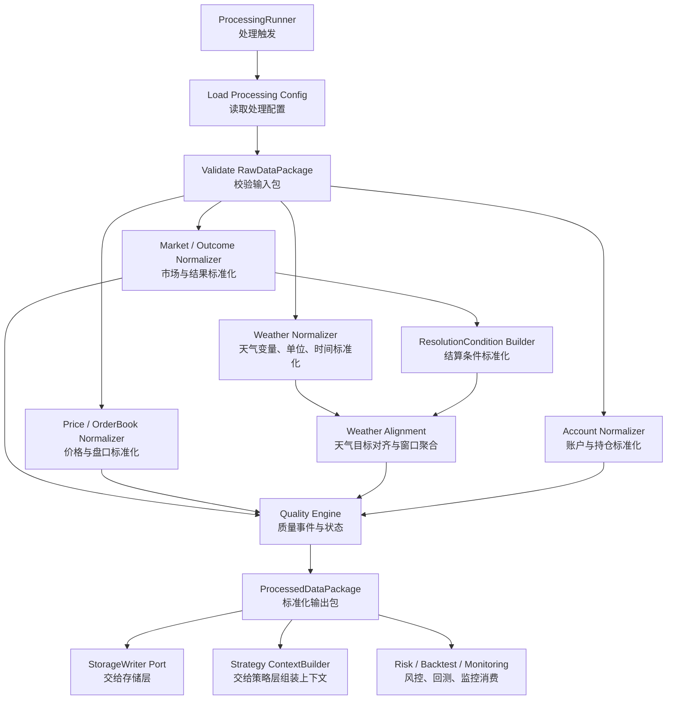

# 数据处理层开发设计文档

## 1. 文档定位

本文档是 `prd/模块设计/02 数据处理层/数据处理层.md` 的开发设计文档，用于把产品 PRD 转换为可实施、可评审、可验收的工程设计。

数据处理层的核心职责是：

```text
消费数据接入层输出的 Raw（原始/半结构化）对象
        ↓
标准化 market、outcome、price、orderbook、weather、account 等数据
        ↓
执行时间、单位、映射、结算条件与质量检查
        ↓
输出可追溯、可版本化、可质检的标准化对象
        ↓
交给 Strategy（策略）、Risk（风控）、Backtest（回测）、Storage（存储）和 Monitoring（监控）
```

本层不做外部 API 调用，不估计真实发生概率，不生成交易信号，不做风控决策，不下单，不实现数据库 Repository / DAO（数据访问对象）细节。它只负责把上游 Raw 数据翻译成下游能稳定消费的标准化语言。

## 2. 设计目标

### 2.1 MVP 目标

1. 消费数据接入层输出的 `RawDataPackage`。
2. 把 `EventRaw`、`MarketRaw`、`PriceSnapshotRaw`、`OrderBookSnapshotRaw`、`PriceHistoryRaw`、`WeatherRaw`、`MarketWeatherMapping`、账户与持仓相关 Raw 对象转换为标准化对象；订单与成交完整标准化延后。
3. 明确区分 `outcome_side`（YES / NO）与 `order_side`（BUY / SELL），避免交易语义混用。
4. 统一价格到 0 到 1 区间，并输出 bid（买价）、ask（卖价）、mid price（中间价）、spread（价差）和 implied probability（隐含概率）。
5. 统一 UTC 时间、resolution timezone（结算时区）、forecast run time（预报运行时间）、data available time（数据可见时间）和 `as_of_time_utc`。
6. 统一天气变量、单位、location（地点）、station（站点）、目标窗口与聚合口径。
7. 基于 `MarketWeatherMapping` 对齐 market 与 weather，输出 `StandardMarketWeatherTarget`、`WeatherWindowSummary` 和 `primary_forecast_summary_id`。
8. 标准化天气 market 的 `StandardResolutionCondition`（标准结算条件），明确 YES / NO 条件方向、比较符、阈值、单位和 edge case（边界情况）引用。
9. 输出 `MarketDataQualityReport`，拆分 `quality_status`、`strategy_eligible`、`research_eligible`、`auto_trading_allowed` 与 `quality_events`。
10. 输出 `ProcessedDataPackage`，保留运行上下文、输入 Raw 引用、input hash（输入哈希）、规则版本、配置版本、质量策略版本和幂等键。
11. 支持同一输入同一规则版本的幂等重跑，以及不同规则版本的历史保留式重算。

### 2.2 非目标

MVP 阶段不实现以下能力：

1. 不拉取外部数据，不直接读取或写入外部 API。
2. 不估计真实概率，不生成 alpha（超额收益信号）或交易信号。
3. 不决定下单金额、订单价格、是否交易或是否撤单。
4. 不做最终风控过滤，价差、深度、流动性阈值等交易性过滤归属风控层。
5. 不实现数据库 Repository / DAO、迁移脚本或具体 SQL 表结构。
6. 不做多天气源融合建模。
7. 不做完整历史回测引擎。
8. 不硬编码某一个具体天气 market 规则。
9. 不用 `1 - other_side` 自动派生缺失侧可成交价格。
10. MVP 不完整标准化订单、成交生命周期。
11. MVP 不实现 forecast / observation 点级对齐解释对象与多模型分歧分析。

## 3. 架构总览

### 3.1 架构目录建议

```text
data_processing/
  config/
    schemas.py
    defaults.py
  core/
    enums.py
    errors.py
    models.py
    package.py
    raw_contract.py
    run_context.py
    versioning.py
  normalizers/
    market.py
    outcome.py
    price.py
    orderbook.py
    price_history.py
    weather.py
    account.py
  weather/
    variable_registry.py
    unit_converter.py
    time_window.py
    aggregation.py
    alignment.py
    resolution_condition.py
  quality/
    events.py
    freshness.py
    policy.py
    report.py
  services/
    processing_runner.py
    package_builder.py
    idempotency.py
    metrics.py
  ports/
    storage_writer.py
    monitoring_sink.py
```

说明：

| 目录 | 职责 |
|---|---|
| `config` | 定义数据处理规则配置、默认值和版本摘要，不保存 API 密钥 |
| `core` | 通用枚举、错误、标准对象、Raw 契约适配、运行上下文、输出包与版本字段 |
| `normalizers` | 各类 Raw 对象到标准对象的纯转换逻辑 |
| `weather` | 天气变量、单位换算、时间窗口解析、聚合、对齐与结算条件标准化 |
| `quality` | 新鲜度、质量事件、质量策略、质量报告 |
| `services` | 一次处理编排、输出包构建、幂等键生成、指标汇总 |
| `ports` | 对存储层、监控层的接口契约；只定义端口，不实现 DAO |

### 3.2 架构模式

数据处理层采用 Pipeline（流水线）+ Normalizer（标准化器）+ Policy（策略配置）模式。

| 层次 | 职责 |
|---|---|
| Runner | 创建 `processing_run_id`，读取配置，编排处理流水线 |
| RawContractAdapter | 校验并适配接入层 RawDataPackage 字段命名，生成输入 hash 与统一时间字段 |
| Normalizer | 单一对象标准化，不访问外部 API，不读写数据库 |
| Weather Alignment | 基于 mapping、时间窗口、单位和天气点进行对齐与聚合 |
| Quality Policy | 根据质量规则生成质量事件和状态，不做风控交易决策 |
| Package Builder | 汇总标准对象、质量报告、指标、追溯信息和幂等键 |
| Port | 向存储层、监控层输出稳定契约 |

设计约束：

1. `normalizers` 不依赖策略层、风控层、执行层。
2. `weather` 模块不调用 Weather API，只处理 `WeatherRaw`。
3. `quality` 模块只输出数据质量状态，不决定交易仓位、订单价格或执行动作。
4. `ports/storage_writer.py` 只定义写入协议，具体落库和 DAO 归属存储层。
5. 所有对象必须可序列化，不依赖 SQLite 专属能力。

### 3.2.1 接入层与结算规则边界

数据接入层已经负责从 question、description、rules 与 metadata 中生成 `MarketWeatherMapping`，并保留 rules 原文引用。数据处理层继续承担 `StandardResolutionCondition` 的结构化标准化，但必须遵守以下边界：

1. 数据处理层可以基于 `MarketWeatherMapping`、`MarketRaw.question`、`MarketRaw.description`、`MarketRaw.rules` 或 `rules_ref` 做本地文本解析。
2. 数据处理层不得外部抓取 rules，不调用 Polymarket、Weather 或第三方网页。
3. 如果接入层已提供明确的 operator、threshold、unit、YES / NO direction（方向）字段，数据处理层优先使用这些字段并做标准化。
4. 如果接入层只提供原文引用，数据处理层可尝试解析；无法明确时输出人工复核质量事件，不猜测规则。
5. `ResolutionConditionBuilder` 的输出必须携带 `condition_input_hash`，用于区分同一 market 在不同规则文本或人工修订下的结果。

### 3.3 一次处理链路



### 3.4 ProcessingRunContext

每次处理运行必须创建统一 `ProcessingRunContext`（处理运行上下文），贯穿日志、质量事件、指标和 `ProcessedDataPackage`。

| 字段 | 说明 |
|---|---|
| `processing_run_id` | 本轮数据处理运行 ID |
| `ingestion_run_id` | 来源接入运行 ID |
| `started_at_utc` | 处理开始时间，UTC |
| `completed_at_utc` | 处理完成时间，UTC，可为空 |
| `as_of_time_utc` | 回测或 replay（回放）视角下的当时可见时间；实时默认等于本轮处理时间 |
| `mode` | `live` / `dry_run` / `backtest` / `replay` / `research` |
| `processing_config_version` | 处理配置版本或配置摘要 |
| `processing_rules_version` | 标准化规则版本 |
| `aggregation_policy_version` | 天气聚合规则版本 |
| `quality_policy_version` | 质量策略版本 |
| `input_package_hash` | 输入 Raw 包摘要 |
| `request_scope` | 本轮处理范围，例如 market_ids、event_ids、data_types |

约束：

1. `live` 模式也不得由数据处理层决定下单。
2. `backtest` / `replay` 模式只能使用 `data_available_at_utc <= as_of_time_utc` 的数据。
3. `processing_run_id` 必须写入所有质量事件与输出报告，便于复盘。

## 4. 关键设计原则

1. Standardized First（标准优先）：下游只消费标准化对象，不依赖外部 API 裸响应字段。
2. Traceability（可追溯性）：所有标准对象保留 `source`、`fetched_at_utc`、`raw_data_ref`、`ingestion_run_id`、`processing_run_id` 和规则版本。
3. No Hidden Guess（不隐式猜测）：单位、时间窗口、YES / NO 方向、结算边界不明确时输出质量事件，不自行补规则。
4. Time Safety（时间安全）：统一 UTC，并通过 `as_of_time_utc` 与 `data_available_at_utc` 防止未来函数。
5. Policy Versioning（策略版本化）：标准化规则、聚合规则、质量策略必须可版本化。
6. Quality Is Not Trading（质量不等于交易）：数据处理层输出质量状态，最终交易过滤归属风控层与执行层。
7. Idempotency（幂等性）：同一输入与同一规则版本重跑应输出稳定结果，不产生不可控重复数据。
8. Sensitive By Default（默认保护敏感信息）：账户、订单、成交等敏感字段不得出现在普通日志、错误和 metrics（指标）中。

## 5. 核心对象设计

本节是开发对象设计，不等同于最终数据库表结构。MVP 阶段建议与现有 `data_ingestion` 保持一致，优先使用 `dataclass(slots=True)` 定义 DTO（数据传输对象）与配置对象；必要校验放在 normalizer（标准化器）和 quality gate（质量门禁）中显式输出质量事件。Pydantic（数据校验库）可作为后续外部输入强校验选项，但不作为 MVP 默认依赖。

### 5.1 通用字段约定

所有标准化对象建议包含：

| 字段 | 说明 |
|---|---|
| `source` | 原始数据源，例如 `polymarket_gamma`、`polymarket_clob`、`open_meteo` |
| `fetched_at_utc` | 数据接入层拉取时间，UTC |
| `processed_at_utc` | 数据处理时间，UTC |
| `data_available_at_utc` | 下游可见该数据的时间，回测防未来函数 |
| `raw_data_ref` | 原始响应引用，可为文件路径、对象存储 key 或摘要 |
| `ingestion_run_id` | 来源接入运行 ID |
| `processing_run_id` | 本轮处理运行 ID |
| `processing_rules_version` | 标准化规则版本 |
| `idempotency_key` | 幂等键 |

### 5.2 StandardMarket

| 字段 | 类型建议 | 说明 |
|---|---|---|
| `market_id` | `str` | Polymarket market ID |
| `event_id` | `str | None` | 所属 event ID |
| `question` | `str` | 市场题干 |
| `description` | `str | None` | 市场描述 |
| `rules_ref` | `str | None` | 结算规则原文引用 |
| `market_type` | `str` | `weather` / `non_weather` / `unknown` |
| `status` | `str` | `active` / `closed` / `resolved` / `unknown` |
| `tradable` | `bool` | 仅表示数据质量角度可进入策略判断，不等于最终可交易 |
| `end_time_utc` | `datetime | None` | 市场结束时间，UTC |
| `resolution_time_utc` | `datetime | None` | 可结算时间，UTC |
| `raw_status` | `dict` | 原始 active / closed / resolved 映射 |
| `outcome_count` | `int` | outcome 数量 |
| `token_ids` | `list[str]` | outcome token ID 列表 |

硬性约束：

1. 天气 market 没有有效 `MarketWeatherMapping` 时，不得标记为可自动实盘。
2. `status` 必须能追溯到 Polymarket 原始状态字段。
3. 非二元 market 在 MVP 可输出标准 market，但必须通过质量事件标记 `unsupported_outcome_structure`。

### 5.3 StandardOutcome

| 字段 | 类型建议 | 说明 |
|---|---|---|
| `outcome_id` | `str` | 内部 outcome 标识 |
| `market_id` | `str` | 所属 market |
| `token_id` | `str` | Polymarket outcome token ID |
| `raw_outcome` | `str` | 原始 outcome 文本 |
| `normalized_outcome` | `str` | MVP 为 `YES` / `NO` |
| `outcome_side` | `str` | `YES` / `NO` |
| `is_supported` | `bool` | 当前系统是否支持该 outcome |
| `mapping_confidence` | `str` | `explicit` / `inferred` / `failed` |

约束：

1. YES / NO token 映射必须明确。
2. outcome 数量不是 2，或无法确定 YES / NO token 时，输出质量事件，不猜测交易方向。

### 5.4 StandardPriceSnapshot

| 字段 | 类型建议 | 说明 |
|---|---|---|
| `market_id` | `str` | market ID |
| `token_id` | `str` | outcome token ID |
| `outcome_side` | `str` | `YES` / `NO` |
| `order_side` | `str | None` | `BUY` / `SELL`，价格快照中通常为空 |
| `best_bid` | `float | None` | 最优买价，0 到 1 |
| `best_ask` | `float | None` | 最优卖价，0 到 1 |
| `mid_price` | `float | None` | 中间价 |
| `last_price` | `float | None` | 最近价格，若数据源提供 |
| `spread` | `float | None` | 价差 |
| `executable_buy_price` | `float | None` | 买入该 outcome 的可成交参考价，通常来自 `best_ask` |
| `executable_sell_price` | `float | None` | 卖出该 outcome 的可成交参考价，通常来自 `best_bid` |
| `implied_probability_mid` | `float | None` | 基于 `mid_price` 的市场隐含概率 |
| `implied_probability_bid` | `float | None` | 基于 `best_bid` 的市场隐含概率 |
| `implied_probability_ask` | `float | None` | 基于 `best_ask` 的市场隐含概率 |
| `price_source` | `str` | `price` / `midpoint` / `orderbook` 等来源说明 |
| `price_basis` | `str` | `bid` / `ask` / `mid` / `last` / `derived` |
| `derived` | `bool` | 是否派生 |
| `derived_from` | `str | None` | 派生来源，例如 `bid_ask` |
| `source_timestamp_utc` | `datetime | None` | 数据源时间 |
| `is_stale` | `bool` | 是否过期 |

约束：

1. 所有价格必须在 0 到 1 区间。
2. `best_bid <= best_ask` 是基础质量规则，不满足时输出 `bid_ask_inverted`。
3. `mid_price` 缺失时允许由 `(best_bid + best_ask) / 2` 派生，并显式记录 `derived=true` 与 `derived_from=bid_ask`。
4. MVP 不允许用 `1 - other_side` 自动派生缺失侧价格。
5. 数据处理层只计算 market implied probability（市场隐含概率），不计算真实概率。

### 5.5 StandardOrderBookSummary

| 字段 | 类型建议 | 说明 |
|---|---|---|
| `market_id` | `str` | market ID |
| `token_id` | `str` | outcome token ID |
| `outcome_side` | `str` | `YES` / `NO` |
| `best_bid` | `float | None` | 最优买价 |
| `best_ask` | `float | None` | 最优卖价 |
| `spread` | `float | None` | 价差 |
| `midpoint` | `float | None` | 中间价 |
| `bid_depth` | `float | None` | 买盘深度摘要 |
| `ask_depth` | `float | None` | 卖盘深度摘要 |
| `depth_levels` | `int` | 使用档位数量 |
| `min_order_size` | `float | None` | 最小订单数量 |
| `tick_size` | `float | None` | 最小价格单位 |
| `snapshot_id` | `str` | 原始快照 ID |
| `source_timestamp_utc` | `datetime | None` | 数据源时间 |

MVP 至少输出 best bid / best ask / spread / midpoint；深度摘要只做结构化整理，不做成交模拟。

### 5.6 StandardPriceHistoryPoint

| 字段 | 类型建议 | 说明 |
|---|---|---|
| `market_id` | `str | None` | market ID |
| `token_id` | `str` | outcome token ID |
| `outcome_side` | `str | None` | `YES` / `NO` |
| `timestamp_utc` | `datetime` | 历史价格点时间 |
| `price` | `float` | 标准价格，0 到 1 |
| `fidelity` | `str` | 采样粒度 |
| `data_available_at_utc` | `datetime` | 回测视角可见时间 |

### 5.7 StandardWeatherPoint

| 字段 | 类型建议 | 说明 |
|---|---|---|
| `variable` | `str` | 标准变量名，例如 `max_temperature` |
| `raw_variable` | `str` | 原始变量名 |
| `value` | `float | None` | 标准单位数值 |
| `raw_value` | `float | None` | 原始数值 |
| `unit` | `str` | 标准单位 |
| `raw_unit` | `str` | 原始单位 |
| `provider_type` | `str` | `forecast` / `observation` / `resolution_evidence` |
| `source` | `str` | 数据源 |
| `model` | `str | None` | 预报模型 |
| `run_time_utc` | `datetime | None` | 模型运行时间 |
| `valid_time_utc` | `datetime | None` | 预报或观测对应时间 |
| `location_id` | `str` | 内部位置 ID |
| `station_id` | `str | None` | 站点 ID |
| `lat` | `float | None` | 纬度 |
| `lon` | `float | None` | 经度 |
| `conversion_applied` | `bool` | 是否执行单位换算 |
| `conversion_rule_id` | `str | None` | 单位换算规则 ID |

MVP 标准变量包括 `max_temperature`、`min_temperature`、`temperature`、`precipitation_sum`、`rainfall_sum`、`snowfall_sum`、`wind_speed`、`wind_speed_max`、`wind_gust_max`。

### 5.8 StandardMarketWeatherTarget

| 字段 | 类型建议 | 说明 |
|---|---|---|
| `market_id` | `str` | market ID |
| `condition_id` | `str` | 关联 `StandardResolutionCondition` |
| `location_id` | `str` | 内部地点 ID |
| `location_name` | `str | None` | 标准地点名 |
| `lat` | `float | None` | 纬度 |
| `lon` | `float | None` | 经度 |
| `station_id` | `str | None` | 站点 ID |
| `target_variable` | `str` | 标准天气变量 |
| `target_date_local` | `date` | 结算目标日期，本地结算时区 |
| `target_window_local` | `str` | 原始或标准化本地时间窗口 |
| `target_window_start_utc` | `datetime` | 目标窗口开始，UTC |
| `target_window_end_utc` | `datetime` | 目标窗口结束，UTC |
| `timezone` | `str` | 结算时区 |
| `unit` | `str` | 目标单位 |
| `mapping_id` | `str | None` | 来源 mapping 标识 |
| `mapping_status` | `str` | `parsed` / `manual_review` / `failed` |

约束：

1. `mapping_status != parsed` 不进入自动实盘上下文。
2. 缺少 timezone、unit、target window 或结算条件时，输出质量事件。

### 5.9 StandardResolutionCondition

| 字段 | 类型建议 | 说明 |
|---|---|---|
| `market_id` | `str` | market ID |
| `condition_id` | `str` | 内部条件 ID |
| `target_variable` | `str` | 标准天气变量 |
| `raw_condition_text` | `str | None` | 原始条件文本 |
| `yes_condition_text` | `str | None` | YES 对应原始条件文本 |
| `no_condition_text` | `str | None` | NO 对应原始条件文本 |
| `operator` | `str | None` | `gt` / `gte` / `lt` / `lte` / `eq` / `between` |
| `threshold_value` | `float | None` | 单阈值条件标准单位数值 |
| `lower_bound` | `float | None` | 区间下界 |
| `upper_bound` | `float | None` | 区间上界 |
| `inclusive_policy` | `str | None` | 边界包含规则 |
| `unit` | `str | None` | 标准单位 |
| `raw_unit` | `str | None` | 原始单位 |
| `rounding_policy` | `str | None` | 四舍五入或取整规则 |
| `precision` | `str | None` | 结算精度 |
| `tie_policy` | `str | None` | 等于阈值、缺测、官方修正规则 |
| `edge_case_rules_ref` | `str | None` | 边界规则原文引用 |
| `resolution_source_name` | `str | None` | 结算来源名称 |
| `resolution_source_url` | `str | None` | 结算来源 URL |
| `parsing_status` | `str` | `parsed` / `manual_review` / `failed` |

约束：

1. 无法明确 YES 条件方向、比较符、阈值或区间边界时，不允许自动实盘。
2. 数据处理层只结构化 market 规则，不创造或推断 PRD 未确认的结算规则。

### 5.10 WeatherWindowSummary

| 字段 | 类型建议 | 说明 |
|---|---|---|
| `market_id` | `str` | market ID |
| `target_variable` | `str` | 标准变量 |
| `provider_type` | `str` | `forecast` / `observation` |
| `provider` | `str` | 天气数据源 |
| `model` | `str | None` | 预报模型 |
| `run_time_utc` | `datetime | None` | 预报运行时间 |
| `aggregation_method` | `str` | `max` / `min` / `sum` / `exact_or_nearest` |
| `window_start_local` | `datetime` | 本地窗口开始 |
| `window_end_local` | `datetime` | 本地窗口结束 |
| `window_start_utc` | `datetime` | UTC 窗口开始 |
| `window_end_utc` | `datetime` | UTC 窗口结束 |
| `timezone` | `str` | 聚合使用的时区 |
| `value` | `float | None` | 聚合后标准单位数值 |
| `unit` | `str` | 标准单位 |
| `source_points_count` | `int` | 实际参与聚合的数据点数量 |
| `expected_points_count` | `int` | 理论应有数据点数量 |
| `coverage_ratio` | `float | None` | 数据覆盖率 |
| `min_required_coverage_ratio` | `float` | 最小覆盖率要求 |
| `nearest_point_offset_minutes` | `float | None` | 最近点偏移分钟数 |
| `window_boundary_policy` | `str` | 默认 `left_closed_right_open` |
| `aggregation_policy_version` | `str` | 聚合规则版本 |
| `raw_points_ref` | `list[str]` | 原始天气点引用 |

### 5.11 V1 预留：ForecastAlignedPoint / ObservationAlignedPoint

`ForecastAlignedPoint` 与 `ObservationAlignedPoint` 用于记录某个标准天气点为什么被纳入或排除目标窗口，便于策略、回测和复盘解释数据来源。该对象不作为 MVP P0 主链路必交付对象，MVP 只要求 `StandardWeatherPoint` 与 `WeatherWindowSummary` 足够可追溯。

| 字段 | 类型建议 | 说明 |
|---|---|---|
| `market_id` | `str` | market ID |
| `weather_point_id` | `str` | 关联 `StandardWeatherPoint` |
| `provider_type` | `str` | `forecast` / `observation` |
| `provider` | `str` | 天气数据源 |
| `model` | `str | None` | 预报模型，观测可为空 |
| `run_time_utc` | `datetime | None` | 预报运行时间 |
| `valid_time_utc` | `datetime` | 预报或观测对应时间 |
| `window_start_utc` | `datetime` | 目标窗口开始 |
| `window_end_utc` | `datetime` | 目标窗口结束 |
| `is_in_target_window` | `bool` | 是否落入目标窗口 |
| `alignment_policy` | `str` | 对齐策略，例如 `window_contains` / `exact_or_nearest` |
| `offset_minutes` | `float | None` | 与目标时点的偏移分钟数 |
| `data_available_at_utc` | `datetime` | 回测视角可见时间 |

约束：

1. forecast source（预测来源）与 resolution source（结算来源）必须分开保留，不能强行等同。
2. V1 可通过 `all_forecasts` 保留同一 market 下全部标准化 forecast（预报）及其对齐结果；MVP 通过 `primary_forecast_summary_id` 指向配置选中的主摘要。
3. observation（观测）缺失但 forecast 可用时，输出 `forecast_only` 或 `observation_lagging`，不单独阻断策略。

### 5.12 AccountSnapshot / PositionSnapshot

| 对象 | 核心字段 |
|---|---|
| `AccountSnapshot` | `account_id` / `wallet_address`、`cash_balance`、`total_value`、`fetched_at_utc`、`is_stale` |
| `PositionSnapshot` | `market_id`、`token_id`、`outcome_side`、`size`、`avg_price`、`current_price`、`unrealized_pnl`、`fetched_at_utc` |

订单与成交完整标准化延后到 V1 或执行层 / 存储层。敏感字段默认不进入普通输出；如需进入受控存储输出，必须由配置显式开启，日志、错误和 metrics 始终脱敏。

### 5.13 QualityEvent

| 字段 | 类型建议 | 说明 |
|---|---|---|
| `event_id` | `str` | 质量事件 ID |
| `code` | `str` | 事件代码 |
| `severity` | `str` | `info` / `warning` / `strategy_blocking` / `live_blocking` / `blocking` |
| `data_type` | `str` | `market` / `price` / `weather` / `account` 等 |
| `market_id` | `str | None` | 关联 market |
| `token_id` | `str | None` | 关联 token |
| `message` | `str` | 人类可读说明 |
| `details` | `dict` | 结构化细节，禁止放 secret（密钥） |
| `raw_data_ref` | `str | None` | 原始数据引用 |
| `processing_run_id` | `str` | 处理运行 ID |
| `created_at_utc` | `datetime` | 创建时间 |

### 5.14 MarketDataQualityReport

| 字段 | 类型建议 | 说明 |
|---|---|---|
| `market_id` | `str` | market ID |
| `quality_status` | `str` | `ready` / `warning` / `blocked` / `manual_review` / `unsupported` |
| `strategy_eligible` | `bool` | 是否可进入自动策略判断 |
| `research_eligible` | `bool` | 是否可进入 observation / research（观察 / 研究）上下文 |
| `auto_trading_allowed` | `bool` | 是否允许进入自动实盘链路 |
| `quality_events` | `list[QualityEvent]` | 质量事件列表 |
| `blocking_reasons` | `list[str]` | 阻断策略的原因 |
| `research_blocking_reasons` | `list[str]` | 阻断观察研究上下文的原因 |
| `live_blocking_reasons` | `list[str]` | 阻断实盘的原因 |
| `quality_policy_version` | `str` | 质量策略版本 |

状态原则：

1. `forecast_only` / `observation_lagging` 不单独阻断策略。
2. `account_stale` 不阻断 `strategy_eligible`，但必须设置 `auto_trading_allowed=false`。
3. `mapping_unparsed`、`missing_resolution_condition`、`unit_missing`、`target_window_unparsed` 等天气合约关键问题必须阻断自动策略与自动实盘，但可保留 `research_eligible=true` 的观察研究上下文。

### 5.15 ProcessedDataPackage

```python
from dataclasses import dataclass
from datetime import datetime

@dataclass
class ProcessedDataPackage:
    processing_run_id: str
    ingestion_run_id: str
    run_context: "ProcessingRunContext"
    started_at_utc: datetime
    completed_at_utc: datetime | None
    input_package_hash: str
    markets: list["StandardMarket"]
    outcomes: list["StandardOutcome"]
    prices: list["StandardPriceSnapshot"]
    orderbooks: list["StandardOrderBookSummary"]
    price_history: list["StandardPriceHistoryPoint"]
    weather_points: list["StandardWeatherPoint"]
    weather_targets: list["StandardMarketWeatherTarget"]
    resolution_conditions: list["StandardResolutionCondition"]
    weather_window_summaries: list["WeatherWindowSummary"]
    primary_forecast_summary_id: str | None
    accounts: list["AccountSnapshot"]
    positions: list["PositionSnapshot"]
    quality_reports: list["MarketDataQualityReport"]
    skipped_market_reports: list["MarketDataQualityReport"]
    metrics: "ProcessingMetrics"
    errors: list["ProcessingErrorRecord"]
```

`ProcessedDataPackage` 必须满足：

1. 可序列化。
2. 可批量写入。
3. 不依赖 SQLite 专属特性。
4. 包含完整运行上下文、配置版本、规则版本、质量策略版本、输入 Raw 引用和输入 hash。
5. 被质量门禁跳过的 market 仍能输出观察用标准化对象和质量报告。

## 6. 处理流水线设计

### 6.1 输入校验

输入：

1. `RawDataPackage`
2. `ProcessingConfig`
3. `ProcessingRunContext`

校验内容：

| 校验项 | 行为 |
|---|---|
| 输入包为空 | 本轮输出错误报告，不产生 ready market |
| `ingestion_run_id` 缺失 | 阻断本轮处理 |
| Raw 对象缺少 `source` / `fetched_at` | 输出质量事件 |
| `as_of_time_utc` 缺失 | 实时模式使用 `processed_at_utc`，回测 / replay 模式阻断 |
| 输入对象 source time 晚于 `as_of_time_utc` | 回测 / replay 模式过滤并输出 future data 事件 |

输入适配：

1. `RawContractAdapter` 先于所有 normalizer 执行。
2. 将接入层字段 `fetched_at`、`timestamp`、`run_time`、`forecast_time`、`observed_time` 适配为处理层统一使用的 UTC 字段。
3. 生成 `input_package_hash` 与必要的 `input_object_hash`，供幂等键、复盘和重跑使用。
4. 字段命名适配只解决契约差异，不做业务标准化或质量决策。

### 6.2 Market 与 Outcome 标准化

步骤：

1. 读取 `EventRaw`、`MarketRaw`。
2. 生成 `StandardMarket`，统一 market ID、event ID、status、时间字段和 rules 引用。
3. 生成 `StandardOutcome`，明确 YES / NO token 映射。
4. 对非二元或无法映射 outcome 的 market 输出 `unsupported_outcome_structure`。
5. 保留原始 question、description、rules 引用，不丢弃追溯信息。

### 6.3 Price 与 OrderBook 标准化

步骤：

1. 读取 `PriceSnapshotRaw` 和 `OrderBookSnapshotRaw`。
2. 按 token 关联 `StandardOutcome`。
3. 校验价格范围 0 到 1。
4. 校验 `best_bid <= best_ask`。
5. 缺失 midpoint 时按配置允许由 bid / ask 派生。
6. 计算 spread 和 implied probability（隐含概率）。
7. 输出 `StandardPriceSnapshot` 与 `StandardOrderBookSummary`。

禁止行为：

1. 不用 YES / NO 互补关系自动生成可成交价格。
2. 不基于 spread 或深度阈值决定策略是否可交易。
3. 不做成交模拟。

### 6.4 时间与时区标准化

步骤：

1. 所有内部时间转换为 UTC。
2. 对天气结算目标保留 local timezone（本地时区）语义。
3. 解析 `target_date_local`、`target_window_local` 和 UTC 窗口。
4. 为回测和 replay 输出 `data_available_at_utc`。
5. 对 DST（夏令时）、跨日窗口、缺失时区输出明确质量事件。

时间窗口无法解析时，标记 `target_window_unparsed`，不得自行猜测。

### 6.5 Weather 标准化

步骤：

1. 读取 `WeatherRaw`。
2. 通过 variable registry（变量注册表）把原始变量映射为标准变量。
3. 按配置把单位转换为 °C、mm、km/h。
4. 保留 `raw_variable`、`raw_value`、`raw_unit` 与换算规则 ID。
5. 输出 `StandardWeatherPoint`。

基础单位换算：

| 类型 | 支持换算 |
|---|---|
| 温度 | °F ↔ °C |
| 降水 | inch ↔ mm |
| 风速 | mph ↔ km/h |

如果目标单位缺失或无法换算，输出质量事件，不自动猜测。

### 6.6 Market 与 Weather 对齐

步骤：

1. 读取 `MarketWeatherMapping`。
2. 校验 `parsing_status == parsed`。
3. 生成 `StandardResolutionCondition`。
4. 生成 `StandardMarketWeatherTarget`。
5. 选择与目标窗口相关的 forecast（预报）与 observation（观测）天气点。
6. 按变量默认聚合规则生成 `WeatherWindowSummary`。
7. 按配置标记 `primary_forecast_summary_id`，同时保留全部 `WeatherWindowSummary` 供后续策略或复盘读取。

MVP 默认聚合规则：

| 标准变量 | 默认聚合方式 |
|---|---|
| `max_temperature` | `max` |
| `min_temperature` | `min` |
| `precipitation_sum` | `sum` |
| `rainfall_sum` | `sum` |
| `snowfall_sum` | `sum` |
| `wind_speed_max` | `max` |
| `wind_gust_max` | `max` |
| `temperature_at_time` | `exact_or_nearest` |

聚合约束：

1. 窗口必须来自 `MarketWeatherMapping.target_time_window` 与 `timezone`。
2. MVP 默认窗口边界策略为 `[start, end)`，即 `left_closed_right_open`。
3. `exact_or_nearest` 必须配置最大允许偏移。
4. `coverage_ratio` 低于阈值时输出 `weather_low_coverage`。
5. daily（逐日）与 hourly（逐小时）同时存在时，优先级必须由配置决定。

### 6.7 账户与持仓标准化

步骤：

1. 读取 `AccountSnapshotRaw`、`PositionRaw`。
2. 标准化账户 ID、钱包地址、余额、持仓、价格与盈亏字段。
3. 对账户快照执行 freshness（新鲜度）检查。
4. 账户过期时输出 `account_stale`，设置 `auto_trading_allowed=false`。
5. 日志、错误和 metrics 中默认脱敏 wallet address（钱包地址）和 balance（余额）明细。
6. `OrderRaw` 与 `TradeRaw` 在 MVP 只保留输入扩展位，不进入默认 `ProcessedDataPackage`。

### 6.8 质量报告与输出包构建

步骤：

1. 汇总各阶段质量事件。
2. 根据 `quality_event_severity_map` 计算 severity（严重程度）。
3. 根据 `strategy_blocking_event_codes` 计算 `strategy_eligible`。
4. 根据 `research_blocking_event_codes` 计算 `research_eligible`。
5. 根据 `live_blocking_event_codes` 计算 `auto_trading_allowed`。
6. 为每个候选 market 输出 `MarketDataQualityReport`。
7. 构建 `ProcessedDataPackage`。
7. 输出处理指标和错误记录。

## 7. 质量事件与状态设计

### 7.1 质量状态

| 状态 | 说明 |
|---|---|
| `ready` | 可进入自动策略判断，且无阻断性质量事件 |
| `warning` | 可进入自动策略判断，但存在 warning（警告）事件 |
| `blocked` | 不可进入自动策略判断 |
| `manual_review` | 需要人工复核，通常不得自动实盘 |
| `unsupported` | 当前 MVP 不支持，例如非二元 outcome |

### 7.2 建议质量事件代码

| 代码 | 默认严重度 | 说明 |
|---|---|---|
| `missing_required_field` | `blocking` | 标准化必要字段缺失 |
| `unsupported_outcome_structure` | `blocking` | outcome 结构非二元或无法映射 YES / NO |
| `price_out_of_range` | `blocking` | 价格不在 0 到 1 |
| `bid_ask_inverted` | `blocking` | `best_bid > best_ask` |
| `missing_side_price` | `blocking` | YES / NO 某侧价格缺失 |
| `price_stale` | `blocking` | 价格过期 |
| `orderbook_stale` | `blocking` | 订单簿过期 |
| `mapping_unparsed` | `strategy_blocking` | mapping 未解析，不允许自动策略和自动实盘，但允许观察研究 |
| `target_window_unparsed` | `strategy_blocking` | 天气目标窗口无法解析，不允许自动策略和自动实盘，但允许观察研究 |
| `unit_missing` | `strategy_blocking` | 目标单位缺失，不允许自动策略和自动实盘，但允许观察研究 |
| `unit_conversion_failed` | `blocking` | 单位换算失败 |
| `missing_resolution_condition` | `strategy_blocking` | 缺少标准结算条件，不允许自动策略和自动实盘，但允许观察研究 |
| `resolution_condition_ambiguous` | `strategy_blocking` | YES / NO 条件方向、阈值或边界不明确，不允许自动策略和自动实盘，但允许观察研究 |
| `weather_low_coverage` | `warning` | 天气窗口覆盖率不足 |
| `forecast_only` | `warning` | 有预报无观测，不单独阻断策略 |
| `observation_lagging` | `warning` | 观测合理滞后，不单独阻断策略 |
| `forecast_stale` | `blocking` | 预报过期 |
| `account_stale` | `live_blocking` | 账户快照过期，阻断自动实盘 |
| `future_data_filtered` | `blocking` | 回测 / replay 中过滤未来数据 |
| `sensitive_data_redacted` | `info` | 敏感信息已脱敏 |

### 7.3 状态计算规则

1. 出现 `strategy_blocking_event_codes` 中任一事件时，`strategy_eligible=false`。
2. 出现 `research_blocking_event_codes` 中任一事件时，`research_eligible=false`；MVP 默认只有输入包非法、严重 schema 错误或敏感信息泄露风险会阻断研究上下文。
3. 出现 `live_blocking_event_codes` 中任一事件时，`auto_trading_allowed=false`。
4. `mapping_unparsed`、`target_window_unparsed`、`missing_resolution_condition`、`resolution_condition_ambiguous` 等人工复核类事件必须使 `strategy_eligible=false`、`research_eligible=true`、`auto_trading_allowed=false`。
5. `auto_trading_allowed=true` 必须以 `strategy_eligible=true` 为前提。
6. `forecast_only`、`observation_lagging` 等 warning（警告）事件不单独阻断策略，但必须进入质量报告和监控指标。
7. 被跳过自动策略的 market 仍输出 `MarketDataQualityReport`，并保留可追溯原因。

### 7.4 FreshnessResult

| 字段 | 说明 |
|---|---|
| `data_type` | 数据类型 |
| `market_id` | market ID，可为空 |
| `reference_time_utc` | 判断新鲜度的基准时间 |
| `source_timestamp_utc` | 数据源时间 |
| `fetched_at_utc` | 本地拉取时间 |
| `max_age_seconds` | 最大允许年龄 |
| `lag_allowance_seconds` | 允许发布滞后的秒数 |
| `is_stale` | 是否过期 |
| `reason` | 判断原因 |

新鲜度规则必须可配置，observation（观测）需要支持合理发布滞后，不因合理滞后缺失而阻断策略。

## 8. 配置设计

MVP 建议使用 TOML 配置文件，并延续现有配置命名风格：

```text
configs/data_processing.example.toml
configs/data_processing.local.toml
```

配置项只描述数据处理规则，不包含 API 密钥。根节点使用 `[data_processing]`，加载函数建议命名为 `load_processing_config`。

### 8.1 配置结构

```toml
[data_processing.runtime]
internal_timezone = "UTC"
mode = "dry_run"
as_of_time_policy = "processed_at_for_live"

[data_processing.versions]
processing_config_version = "2026-04-26.001"
processing_rules_version = "processing_rules_v1"
aggregation_policy_version = "weather_aggregation_v1"
quality_policy_version = "quality_policy_v1"

[data_processing.time]
require_resolution_timezone = true
max_price_age_seconds = 120
max_orderbook_age_seconds = 120
max_account_age_seconds = 300
max_forecast_run_age_seconds = 21600
observation_lag_allowance_seconds = 600

[data_processing.price]
price_range_min = 0.0
price_range_max = 1.0
midpoint_policy = "derive_from_bid_ask_when_missing"
allow_complement_price_derivation = false
default_price_basis_for_context = "mid"

[data_processing.weather]
standard_temperature_unit = "C"
standard_precipitation_unit = "mm"
standard_wind_speed_unit = "km/h"
require_target_unit = true
window_boundary_policy = "left_closed_right_open"
min_weather_coverage_ratio = 0.8
nearest_time_tolerance_minutes = 30
daily_vs_hourly_precedence = "hourly_first"
allow_forecast_without_observation = true
primary_forecast_provider = "open_meteo"
primary_forecast_model = "GFS"
primary_forecast_run_time_policy = "latest_available"

[data_processing.quality]
research_blocking_event_codes = [
  "invalid_raw_package",
  "sensitive_data_leak_risk",
]
strategy_blocking_event_codes = [
  "missing_required_field",
  "unsupported_outcome_structure",
  "price_out_of_range",
  "bid_ask_inverted",
  "price_stale",
  "orderbook_stale",
  "mapping_unparsed",
  "target_window_unparsed",
  "unit_missing",
  "unit_conversion_failed",
  "missing_resolution_condition",
  "resolution_condition_ambiguous",
  "forecast_stale",
  "future_data_filtered",
]
live_blocking_event_codes = [
  "mapping_unparsed",
  "target_window_unparsed",
  "unit_missing",
  "missing_resolution_condition",
  "resolution_condition_ambiguous",
  "account_stale",
]

[data_processing.output]
emit_skipped_market_report = true
emit_holdout_context = true
persist_processed_package = true
bundle_output_mode = "batch"
emit_sensitive_account_fields = false
account_sensitive_output_scope = "storage_only"
```

### 8.2 配置约束

1. `allow_complement_price_derivation` 在 MVP 固定为 `false`。
2. `max_spread_for_strategy` 不属于数据处理层配置；价差阈值、盘口深度阈值、流动性阈值归属风控层。
3. `default_price_basis_for_context` 只作为 ContextBuilder（上下文构造器）参考，数据处理层不替策略选择交易价格。
4. `primary_forecast_provider`、`primary_forecast_model`、`primary_forecast_run_time_policy` 必须可配置，并用于选择 `primary_forecast_summary_id`。
5. 输出敏感账户字段默认关闭；即使开启，也只影响受控存储输出，不影响日志和 metrics 脱敏要求。

## 9. 幂等、版本与重跑

### 9.1 幂等键建议

| 标准对象 | 建议幂等键 |
|---|---|
| `StandardMarket` | `source + market_id + input_object_hash + processing_rules_version` |
| `StandardOutcome` | `market_id + token_id + processing_rules_version` |
| `StandardPriceSnapshot` | `source + market_id + token_id + source_timestamp 或 fetched_at + input_object_hash + processing_rules_version` |
| `StandardOrderBookSummary` | `source + market_id + token_id + snapshot_id 或 source_timestamp + input_object_hash + processing_rules_version` |
| `StandardPriceHistoryPoint` | `source + market_id + token_id + timestamp + fidelity + processing_rules_version` |
| `StandardWeatherPoint` | `source + provider_type + model + run_time + valid_time + location_id + variable + processing_rules_version` |
| `WeatherWindowSummary` | `market_id + provider + model + run_time + window_start_utc + window_end_utc + variable + aggregation_policy_version` |
| `StandardResolutionCondition` | `market_id + rules_ref + condition_input_hash + processing_rules_version` |
| `MarketDataQualityReport` | run-level 使用 `processing_run_id + market_id`；可重算报告使用 `market_id + input_package_hash + quality_policy_version` |

### 9.2 重跑原则

1. 同一输入、同一规则版本重跑，不应产生不可控重复数据。
2. 不同 `processing_rules_version`、`aggregation_policy_version` 或 `quality_policy_version` 重算，应保留为新版本结果，不覆盖旧结果。
3. 存储层负责最终落库幂等实现，数据处理层必须提供足够的幂等键字段。
4. 回测 / replay 模式下，人工修订 mapping、结算条件或质量策略必须版本化，不能覆盖历史口径。
5. 没有 source timestamp（源时间戳）的快照对象，必须使用 `fetched_at` 与输入对象 hash 作为 fallback（兜底）口径。

### 9.3 版本字段

| 版本字段 | 作用 |
|---|---|
| `processing_config_version` | 说明本轮配置内容 |
| `processing_rules_version` | 说明字段标准化、状态映射、单位映射等规则 |
| `aggregation_policy_version` | 说明天气窗口聚合规则 |
| `quality_policy_version` | 说明质量事件严重度与阻断策略 |
| `input_package_hash` | 说明输入 Raw 包内容 |

## 10. 与下游模块的契约

### 10.1 给 Strategy（策略层）

交付：

1. `StandardMarket`
2. `StandardOutcome`
3. `StandardPriceSnapshot`
4. `StandardOrderBookSummary`
5. `StandardMarketWeatherTarget`
6. `StandardResolutionCondition`
7. `WeatherWindowSummary`
8. `primary_forecast_summary_id`
9. `AccountSnapshot`
10. `PositionSnapshot`
11. `MarketDataQualityReport`
12. 构造 `StrategyContext`（策略上下文）所需的追溯字段与质量状态

约束：

```text
Strategy 不直接读取 RawDataPackage
Strategy 不直接调用外部 API
Strategy 不直接做单位换算
Strategy 不直接解析 Polymarket rules 原文
StrategyContext 由策略层或策略层下的 ContextBuilder 组装
```

### 10.2 给 Risk（风控层）

交付：

1. 标准价格、价差、盘口摘要。
2. 标准账户与持仓。
3. 数据质量状态、质量事件、观察研究可用性与自动实盘权限。
4. market 结束时间与距离结算时间。
5. 流动性与深度摘要。

约束：

1. 风控层基于这些数据判断是否过滤信号。
2. 数据处理层不做最终风控决策。
3. 数据处理层不定义仓位、限价、止损或撤单策略。

### 10.3 给 Backtest（回测层）

交付：

1. 标准历史价格。
2. 标准历史天气点。
3. 标准 market-weather 目标。
4. 标准天气结算条件。
5. 可追溯的历史映射版本。
6. 历史数据质量报告。
7. `as_of_time_utc`、`data_available_at_utc`、规则版本与质量策略版本。

约束：

1. 回测层需要知道当时可见的 forecast run_time，避免未来函数。
2. 回测或 replay 模式下，只能使用 `data_available_at_utc <= as_of_time_utc` 的数据。
3. 历史标准化口径应和实时数据一致。

### 10.4 给 Storage（存储层）

交付：

1. 标准化对象。
2. 处理运行元信息。
3. 数据质量报告。
4. 错误与指标。
5. Raw 引用关系。
6. 幂等键与规则版本字段。

接口建议：

```python
from typing import Protocol

class ProcessedDataWriter(Protocol):
    def save_processed_package(self, package: "ProcessedDataPackage") -> None:
        ...
```

约束：

1. 数据处理层只调用端口，不实现 Repository / DAO。
2. SQL、表结构、迁移和具体事务策略归属存储层。
3. 写入对象必须可序列化，支持批量写入，并保留未来迁移 PostgreSQL 的可能性。

### 10.5 给 Monitoring（监控）与 Notification（通知）

建议输出 `ProcessingMetrics`：

| 指标 | 说明 |
|---|---|
| `processing_run_id` | 本轮处理 ID |
| `ingestion_run_id` | 来源接入 ID |
| `processed_market_count` | 处理 market 数 |
| `ready_market_count` | 可进入策略 market 数 |
| `skipped_market_count` | 跳过 market 数 |
| `skipped_reason_count` | 跳过原因统计 |
| `weather_alignment_success_count` | 天气对齐成功数 |
| `unit_conversion_error_count` | 单位换算错误数 |
| `stale_data_count` | 过期数据数 |
| `ready_but_live_blocked_count` | 可进入策略但禁止实盘的 market 数 |
| `quality_event_count_by_code` | 按质量事件代码统计 |
| `quality_event_count_by_severity` | 按严重程度统计 |
| `duration_ms_by_stage` | 按处理阶段统计耗时 |
| `weather_coverage_ratio_distribution` | 天气窗口覆盖率分布 |
| `unit_conversion_count_by_pair` | 按单位换算对统计 |
| `derived_price_count` | 派生价格数量 |
| `mapping_status_count` | mapping 解析状态统计 |

监控输出不得包含完整 wallet address、账户余额明细、API key、private key（私钥）或签名材料。

## 11. 错误处理与降级

### 11.1 错误类型

| 错误类型 | 说明 | 是否阻断本轮 |
|---|---|---|
| `InvalidRawPackageError` | 输入包结构非法 | 阻断 |
| `SchemaMismatchError` | Raw 对象字段不符合契约 | 视字段决定 |
| `NormalizationError` | 标准化失败 | 局部阻断 |
| `TimeWindowParseError` | 时间窗口解析失败 | 对应 market 阻断自动实盘 |
| `UnitConversionError` | 单位换算失败 | 对应对象阻断 |
| `ResolutionConditionError` | 结算条件无法标准化 | 对应 market 阻断自动实盘 |
| `QualityPolicyError` | 质量策略配置非法 | 阻断本轮 |
| `SensitiveDataLeakRiskError` | 检测到敏感字段进入日志/指标 | 阻断输出或强制脱敏 |

### 11.2 降级策略

| 场景 | MVP 行为 |
|---|---|
| 单个 market 标准化失败 | 跳过该 market，输出质量报告 |
| 单个 token 价格异常 | 对应 market 不进入策略，保留错误原因 |
| mapping 未解析 | 输出观察用报告，不允许自动实盘 |
| forecast 缺失或过期 | 对应 market 不进入策略 |
| observation 合理滞后 | 标记 warning，不单独阻断策略 |
| account 过期 | 不阻断策略研究，但禁止自动实盘 |
| 质量策略配置非法 | 本轮 fail fast（快速失败） |

## 12. 测试设计

### 12.1 Unit Test（单元测试）

测试文件建议延续当前仓库扁平 `tests/test_*.py` 风格，新增：

```text
tests/test_processing_package.py
tests/test_processing_market_normalizer.py
tests/test_processing_price_normalizer.py
tests/test_processing_weather_normalizer.py
tests/test_processing_quality_gate.py
tests/test_processing_config_loader.py
tests/test_processing_raw_contract.py
tests/fixtures/processing_packages.py
```

| 测试对象 | 重点 |
|---|---|
| `MarketNormalizer` | status 映射、时间字段、rules 引用保留 |
| `OutcomeNormalizer` | YES / NO token 映射、非二元 market、模糊 outcome |
| `PriceNormalizer` | 价格范围、bid / ask 反转、midpoint 派生、缺失侧价格 |
| `OrderBookNormalizer` | best bid / ask、spread、depth 摘要 |
| `TimeWindowParser` | UTC、本地时区、DST、跨日窗口、解析失败 |
| `UnitConverter` | °F / °C、inch / mm、mph / km/h、未知单位 |
| `WeatherAggregator` | max / min / sum / exact_or_nearest、覆盖率、最近点偏移 |
| `ResolutionConditionBuilder` | operator、阈值、区间边界、YES / NO 方向、edge case 引用 |
| `QualityPolicy` | severity 映射、strategy / live 阻断状态 |
| `IdempotencyKeyBuilder` | 同输入同规则稳定，不同版本不同 key |

### 12.2 Contract Test（契约测试）

目标是确保数据处理层与数据接入层、策略层、风控层、回测层、存储层对象契约稳定。

必测内容：

1. `RawDataPackage` 输入字段契约。
2. 标准化对象输出字段契约。
3. `ProcessedDataPackage` 可序列化。
4. `MarketDataQualityReport` 状态字段完整。
5. 不输出外部 API 裸响应字段给策略层。
6. `StorageWriter` 端口不依赖具体数据库实现。

### 12.3 Fixture / Fake Package（样例包）测试

至少准备以下 fixture（样例数据）：

1. 正常 weather market：mapping parsed、价格完整、预报完整。
2. 缺价格 market：输出 `missing_side_price`。
3. 非二元 outcome market：输出 `unsupported_outcome_structure`。
4. 缺 mapping market：不允许自动实盘。
5. 缺单位 market：输出 `unit_missing`。
6. forecast_only market：允许进入策略，标记 warning。
7. observation_lagging market：允许进入策略，标记 warning。
8. account_stale：策略可研究，实盘禁止。
9. manual_review mapping：输出观察包，不自动实盘。
10. replay future data：过滤未来数据并输出事件。

### 12.4 Timezone Test（时区测试）

必须覆盖：

1. UTC 与本地结算时区转换。
2. DST（夏令时）切换日。
3. 跨日天气窗口。
4. 缺失 timezone。
5. `as_of_time_utc` 与 `data_available_at_utc`。

### 12.5 Weather Aggregation Test（天气聚合测试）

必须覆盖：

1. max / min / sum / exact_or_nearest。
2. 低覆盖率触发 `weather_low_coverage`。
3. nearest 超出容忍范围时拒绝聚合。
4. daily / hourly 优先级由配置决定。
5. 降水、降雪、风速 source variable（源变量）语义差异。

### 12.6 Replay Test（回放测试）

必须验证：

1. 只使用当时可见 forecast run_time。
2. 只使用 `data_available_at_utc <= as_of_time_utc` 的数据。
3. 人工修订后的 mapping 不覆盖历史版本。
4. 不同规则版本重算可并存。

### 12.7 Security Test（安全测试）

必须验证：

1. 日志、错误、metrics 中不出现 API key、private key、完整 wallet address 或账户明细。
2. `ProcessedDataPackage` 中敏感对象只进入受控输出。
3. 质量事件 `details` 不包含认证 header、签名 payload 或 secret（密钥）。

## 13. MVP 开发任务拆解

### 13.1 第一阶段：P0 纵向骨架

1. 建立 `data_processing` 包结构。
2. 定义配置模型与默认配置。
3. 定义 `RawContractAdapter`、最小 `ProcessingRunContext`、`ProcessedDataPackage`、错误类型。
4. 定义 `ProcessedDataWriter` 与 `MonitoringSink` 端口。
5. 用一个正常 weather market fixture 跑通 `ProcessingRunner.run_once(raw_package)` 的空骨架输出。

### 13.2 第二阶段：Market / Outcome / Price 端到端切片

1. 实现 `MarketNormalizer`。
2. 实现 `OutcomeNormalizer`。
3. 实现 `PriceNormalizer`。
4. 实现 `OrderBookNormalizer`。
5. 组装最小 `MarketDataQualityReport` 与 `ProcessedDataPackage`。
6. 增加价格、盘口、outcome 相关单元测试和一个 fixture 端到端测试。

### 13.3 第三阶段：天气目标、单位与结算条件

1. 实现 UTC 时间标准化工具。
2. 实现 `TimeWindowParser`。
3. 实现 `WeatherVariableRegistry`。
4. 实现 `UnitConverter`。
5. 实现 `WeatherNormalizer`。
6. 实现 `ResolutionConditionBuilder` 与 `StandardMarketWeatherTarget` 构建。

### 13.4 第四阶段：天气窗口聚合与主摘要选择

1. 实现 `WeatherAlignmentService` 的 MVP 窗口筛选。
2. 实现 `WeatherAggregator`。
3. 实现 `primary_forecast_summary_id` 标记逻辑。
4. 增加 Timezone Test（时区测试）与 Weather Aggregation Test（天气聚合测试）的 P0 场景。

### 13.5 第五阶段：账户与质量策略

1. 实现账户与持仓快照标准化。
2. 实现 `FreshnessChecker`。
3. 实现 `QualityPolicy`。
4. 实现 `MarketDataQualityReport` 构建。
5. 实现敏感字段脱敏工具。
6. 明确 `strategy_eligible`、`research_eligible`、`auto_trading_allowed` 的配置化计算。

### 13.6 第六阶段：运行编排与验收

1. 实现 `ProcessingRunner.run_once()`。
2. 组装 `ProcessedDataPackage`。
3. 接入 StorageWriter 测试实现。
4. 接入 MonitoringSink 测试实现。
5. 完成单元测试、契约测试、fixture 测试、回放测试和安全测试。

## 14. 验收标准覆盖矩阵

| 验收项 | PRD 对应条目 | 设计章节 | 验证方式 | 阻断级别 | 备注 |
|---|---|---|---|---|---|
| 消费 `RawDataPackage` | 2.1、10.1 | 6.1、12.2 | Contract Test | P0 | 不直接调用外部 API |
| 标准化 `EventRaw` / `MarketRaw` | 4.1.1、10.2 | 5.2、6.2 | 单元测试 + fixture | P0 | 保留 rules 引用 |
| 明确 YES / NO outcome 与 token | 4.1.2、10.3 | 5.3、6.2 | 单元测试 | P0 | 不猜测模糊方向 |
| 非二元 outcome 输出跳过原因 | 4.1.2、10.4 | 7.2、12.3 | fixture 测试 | P0 | `unsupported_outcome_structure` |
| 价格归一到 0 到 1 | 4.1.3、10.5 | 5.4、6.3 | 单元测试 | P0 | 包括历史价格 |
| 识别价格异常 | 4.1.3、10.6 | 7.2、12.1 | 单元测试 | P0 | 缺价格、非法价格、bid ask 反转 |
| 输出订单簿摘要 | 4.1.4、10.7 | 5.5、6.3 | 单元测试 | P0 | 不做成交模拟 |
| 统一 UTC 与本地结算时区 | 4.1.5、10.8 | 6.4、12.4 | Timezone Test | P0 | 覆盖 DST 和跨日 |
| 构建标准天气目标 | 4.1.7、10.9 | 5.8、6.6 | fixture 测试 | P0 | 基于 mapping |
| mapping 未解析不 ready | 4.1.7、10.10 | 7.2、14 | fixture 测试 | P0 | 不自动实盘 |
| 输出 `StandardResolutionCondition` | 4.1.8、10.11 | 5.9、6.6 | 单元测试 | P0 | 明确 YES / NO 条件 |
| 结算条件不明确时禁止实盘 | 4.1.8、10.12 | 7.2、12.3 | fixture 测试 | P0 | `resolution_condition_ambiguous` |
| 标准化天气变量与单位 | 4.1.6、10.13 | 5.7、6.5 | 单元测试 | P0 | 保留 raw value / raw unit |
| 单位缺失或换算失败输出事件 | 4.1.6、10.14 | 7.2、12.1 | 单元测试 | P0 | 不猜测单位 |
| 天气窗口对齐和聚合 | 4.1.7、10.15 | 5.10、6.6 | Weather Aggregation Test | P0 | 记录覆盖率与版本 |
| 记录聚合规则版本 | 4.1.7、10.16 | 5.10、9.3 | Contract Test | P0 | 支持重算 |
| 拆分质量状态和权限 | 6、10.17 | 5.14、7 | 单元测试 | P0 | `quality_status` / `strategy_eligible` / `research_eligible` / `auto_trading_allowed` |
| forecast_only 不阻断策略 | 4.1.7、10.18 | 7.2、12.3 | fixture 测试 | P0 | warning |
| account_stale 阻断自动实盘 | 4.1.9、10.18 | 6.7、7.2 | fixture 测试 | P0 | 不阻断研究 |
| 账户与持仓标准化 | 4.1.9、10.19 | 5.12、6.7 | 单元测试 | P0 | 敏感字段脱敏；订单、成交延后 |
| 每个候选 market 输出质量报告 | 6、10.20 | 5.14、6.8 | Contract Test | P0 | 包括 skipped market |
| 输出 ContextBuilder 所需对象 | 9.1、10.21 | 10.1 | Contract Test | P0 | 数据处理层不组装具体策略上下文 |
| 标准对象不包含外部 API 裸响应 | 10.22 | 4、10.1 | 架构审查 | P0 | 只保留 raw_data_ref |
| 被跳过 market 可追溯 | 10.23 | 5.14、6.8 | fixture 测试 | P0 | 原因可审计 |
| 保留追溯字段 | 10.24 | 5.1 | Contract Test | P0 | source、fetched_at、raw_data_ref |
| `ProcessedDataPackage` 保留版本和输入 hash | 10.25 | 5.15、9.3 | Contract Test | P0 | 支持复盘 |
| 同输入同版本幂等 | 7.5、10.26 | 9.1、12.1 | 幂等测试 | P0 | 不可控重复为失败 |
| 回测防未来函数 | 7.5、10.27 | 6.1、12.6 | Replay Test | P0 | `as_of_time_utc` |
| 不包含策略、风控、下单、外部 API | 2.2、10.28 | 2.2、3.2、10 | 架构审查 + import 检查 | P0 | 严格边界 |

## 15. V1 / V2 预留设计

### 15.1 V1 预留

1. 更完整的天气窗口聚合策略。
2. 更完善的单位换算与变量字典。
3. 支持更多 market 类型和多 outcome 结构。
4. 标准化历史数据流水线，服务回测层。
5. 数据质量评分与更细粒度质量指标。
6. 人工复核结果的版本化接入。

### 15.2 V2 预留

1. 多天气源融合后的标准化输出。
2. 偏差校准前置特征构造。
3. 订单簿历史回放标准对象。
4. 多策略共享特征层。
5. 图形化数据质量与映射审核视图。

预留约束：V1 / V2 能力不得改变 MVP 的边界原则；数据处理层仍不做外部 API、策略概率、风控决策、下单或 DAO。

## 16. 待确认事项处理

以下事项来自 PRD 的后续新增事项，开发时不得自行假设为已确认：

| 待确认事项 | 本开发设计中的处理 |
|---|---|
| `StandardResolutionCondition` 最终字段类型与枚举值 | 本文给出建议字段；正式开发前需要确认枚举命名和类型 |
| 天气变量 source variable（源变量）语义清单 | 本文只列 MVP 标准变量；precipitation / rainfall / snowfall / wind 需进一步确认 |
| `quality_event_severity_map` 默认配置 | 本文给出建议默认严重度；上线前需主线程复核 |
| 各标准对象最终幂等键与存储层落库约束 | 本文给出数据处理层建议；最终约束由存储层设计确认 |
| daily 与 hourly 数据同时存在时的优先级 | 本文建议配置化，不在代码中隐式选择 |
| `primary_forecast_provider` / model 默认值 | 本文按 Open-Meteo / GFS 示例配置，正式开发前需要确认 |
| exact_or_nearest 最大允许偏移 | 本文示例为 30 分钟，业务阈值需确认 |
| 天气窗口最小覆盖率 | 本文示例为 0.8，业务阈值需确认 |

## 17. 开发注意事项

1. Python 环境统一使用 `uv`，缺少环境优先 `uv venv`，运行命令优先 `uv run`。
2. 新增依赖使用 `uv add` 或 `uv pip install`，不得安装到全局 Python。
3. 不把 API key、private key、钱包敏感信息写入仓库。
4. 数据处理层代码应优先简单可运行，避免为 V2 能力引入重型抽象。
5. 如果开发中需要改变 PRD 或本文档，必须先更新对应文档并告知变更点，确认后再开发。
6. 开发时建议增加 import 依赖检查，确保数据处理层不依赖外部 API client、策略模块、风控决策模块、执行下单模块或具体 DAO 实现。

## 18. 一句话工程原则

```text
数据处理层要像可靠的翻译官：不替策略下判断，但必须把市场、天气、价格、账户说成同一种清楚、可追溯、可检查的语言。
```
